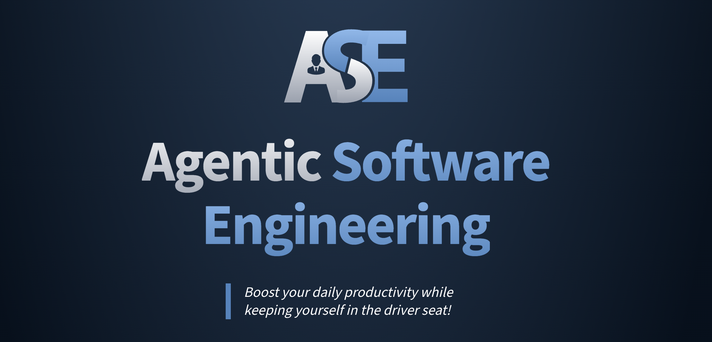
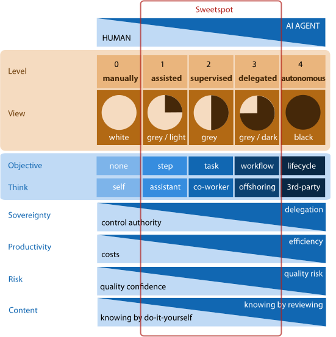
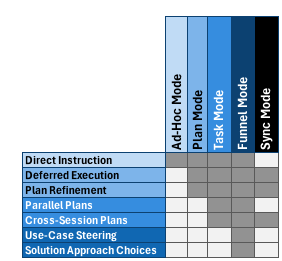

[](https://ase.tools)

https://ase.tools

[](https://github.com/rse)
[](https://github.com/rse)

About
-----

**Agentic Software Engineering (ASE)** is the opinionated companion
tooling of *Dr. Ralf S. Engelschall* for combining the approach of
*Agentic AI* and *Software Engineering* with the help of *Agentic AI
Coding Tools* like *Claude Code*. **ASE** primarily consists of a
*Claude Code* plugin (of about 20K LoC agent skill definitions) and
a companion Command-Line Interface (CLI) tool, including a built-in
*MCP* service (of about 7K LoC TypeScript code). **ASE**, on the
surface, provides 39 agent skills and commands to support the most
important, recurring work-steps in the primary disciplines of *Software
Engineering*, especially in the discipline *Software Development* and
*Software Architecture*.

**ASE** is primarily motivated by the following statement of its primary
author, *Dr. Ralf S. Engelschall*:

> "Software developers in the industrial Software Engineering context,
> in their recurring tasks, should leverage pre-manufactured agentic AI
> skills to boost their daily productivity. Those skills incorporate
> reasonable methodology and automation aspects while keeping the
> developers in the driver seat to ensure stable result quality."

Notices
-------

> [!NOTE]
> **TERMINOLOGY**: The discipline of [*Agentic Software Engineering*](docs/agentic-software-engineering.md)
> in *general* is *Software Engineering*, supported by autonomous *AI
> Agents* to perform tasks across the software development lifecycle.
> This **ASE** product in *particular* is also *agentic*, but not
> strictly based on autonomous agents. Instead, **ASE** focuses on
> supporting the role of a Software Engineer with *Agentic AI Coding
> Tools* towards multi-step operations and a plan/task-driven approach,
> but still strongly focuses on Human-in-the-Loop.

> [!NOTE]
> **TOOL SUPPORT FOCUS**: The primary focus of **ASE** is on the Agentic AI Coding tool [*Claude
> Code*](https://code.claude.com). The secondary focus is on the support
> for [*GitHub Copilot CLI*](https://github.com/features/copilot/cli)
> (just set environment variable `ASE_TOOL=copilot`) and [*OpenAI Codex
> CLI*](https://github.com/openai/codex) (just set environment variable
> `ASE_TOOL=codex`). In the future, additional support could be provided
> also for alternative tools &mdash; if their agent harness features
> (especially hooks, interactive user dialog tool, etc.) realistically
> allow it.

> [!NOTE]
> **STATUS QUO**: **ASE** is still under active initial development
> and somewhat incomplete. All existing functionality is already
> stable and used on a daily basis in production. Feel free to
> already join us on our journey towards [*Agentic Software
> Engineering*](docs/agentic-software-engineering.md).

Unique Selling Points
---------------------

Check out the following scenarios and corresponding **ASE** examples to
see whether **ASE** is right for you:

<table>
<tr>
<td width="50%" valign="top">

- **Boosted Sessions**:
  You want to speed up your interactive sessions and at the same time
  reduce costs by reducing the amount of produced LLM output tokens?
  &rarr; [`/ase-meta-persona`](plugin/skills/ase-meta-persona/help.md)
  `engineer` or even [`/ase-meta-persona`](plugin/skills/ase-meta-persona/help.md)
  `caveman`

- **Alternative Approach Funnel**:
  You prefer a plan-driven approach, but the agent harness's
  Plan Mode is too unstructured and too direct because you want to
  leverage a funnel of alternative approaches first?
  &rarr; [`/ase-code-craft`](plugin/skills/ase-code-craft/help.md)
  `hello: "ase hello" CLI command which prints a nice "Hello World" in red`

- **Named and Persisted Plans**:
  You prefer a plan-driven approach, but the agent harness's Plan Mode is
  regularly too weak, because you want named, persisted, cross-session
  reachable, and strictly structured plans?
  &rarr; [`/ase-task-edit`](plugin/skills/ase-task-edit/help.md)
  `hello`

- **Plan Stress-Testing**:
  You have a task plan, but want to be relentlessly grilled about every
  essential aspect of it until you and the agent reach a shared
  understanding and no open decisions remain?
  &rarr; [`/ase-task-grill`](plugin/skills/ase-task-grill/help.md)
  `hello`

- **Implementation Preflights**:
  You prefer a plan-driven approach, but want to pre-flight the
  implementation without later having to rewind artifacts via the version
  control system or the agent harness's session history?
  &rarr; [`/ase-task-preflight`](plugin/skills/ase-task-preflight/help.md)
  `hello`

- **Project Insights**:
  You want to get a quick insight into a project by determining
  the author, the source files with the most churn, and the module
  structure?
  &rarr; [`/ase-code-insight`](plugin/skills/ase-code-insight/help.md)
  `@tool`

- **Code Comprehension**:
  You want to better comprehend code by finding focused information on
  What, Why, Analogy, Diagram, Cruxes, and Gotchas?
  &rarr; [`/ase-code-explain`](plugin/skills/ase-code-explain/help.md)
  `@tool/src/*.ts`

- **Lexical Code Analysis**:
  You want to analyze code for potential problems
  related to a standard set of code quality aspects?
  &rarr; [`/ase-code-lint`](plugin/skills/ase-code-lint/help.md)
  `@tool/src/*.ts`

- **Document Proofreading**:
  You want your text documents checked and corrected for spelling,
  punctuation, and grammar errors?
  &rarr; [`/ase-docs-proofread`](plugin/skills/ase-docs-proofread/help.md)
  `@README.md`

- **Research Quorum**:
  You want to research a fact by asking multiple (potentially available)
  foreign LLMs and methodologically derive a quorum answer?
  &rarr; [`/ase-meta-quorum`](plugin/skills/ase-meta-quorum/help.md)
  `What is Agentic Software Engineering?`

- **Logical Code Analysis**:
  You want to analyze code for potential problems
  in its logic, semantics, and control flow?
  &rarr; [`/ase-code-analyze`](plugin/skills/ase-code-analyze/help.md)
  `@tool/src/*.ts`

- **Automated Change Logs**:
  You want to get your `CHANGELOG.md` entries
  automatically derived from your recent Git commits?
  &rarr; [`/ase-meta-changelog`](plugin/skills/ase-meta-changelog/help.md)

- **Plan Implementation**:
  You have a named, persisted task plan and now want it implemented as a
  single, complete change set across your project artifacts?
  &rarr; [`/ase-task-implement`](plugin/skills/ase-task-implement/help.md)
  `hello`

- **Artifact Reconciliation**:
  You want one set of artifacts (e.g. CODE, DOCS) automatically aligned
  to reflect the current state of another set (e.g. SPEC, ARCH), one-way
  or bidirectionally?
  &rarr; [`/ase-sync-reconcile`](plugin/skills/ase-sync-reconcile/help.md)
  `-s SPEC -t DOCS`

- **Foreign Source Import**:
  You want external files, URLs, or pasted text ingested and turned into
  structured SPEC, ARCH, CODE, DOCS, or TASK artifacts?
  &rarr; [`/ase-sync-import`](plugin/skills/ase-sync-import/help.md)
  `-t SPEC @requirements.txt`

- **Artifact Export**:
  You want artifact content materialized into derived, side-by-side
  files, like the Data Model rendered as an SVG diagram or the Technology
  Stack rendered as a Markdown table?
  &rarr; [`/ase-sync-export`](plugin/skills/ase-sync-export/help.md)
  `-s SPEC,ARCH`

- **Direct Skill Usage Help**:
  You want usage help for skills directly within your agent tool sessions?
  &rarr; `/ase-xxx-xxx` `--help`

</td>
<td width="50%" valign="top">

- **Diff Summary**:
  You want a raw Git diff turned into a concise, human-readable
  narrative of what changed and why, grouped by intent, and with
  optional intent-coherence check, risk grading and blast radius?
  &rarr; [`/ase-meta-diff`](plugin/skills/ase-meta-diff/help.md)
  `-c -r -b`

- **Change Review**:
  You want the staged Git changes reviewed the way a human reviewer
  would on a pull request, with an approve/reject verdict and
  prioritized, severity-tagged, line-cited findings?
  &rarr; [`/ase-meta-review`](plugin/skills/ase-meta-review/help.md)

- **Guided Bug Fixing**:
  You want a problem or bug resolved through a structured, plan-driven
  funnel of candidate root causes and fix approaches instead of a direct,
  unstructured patch?
  &rarr; [`/ase-code-resolve`](plugin/skills/ase-code-resolve/help.md)
  `the CLI crashes on an empty config file`

- **Guided Refactoring**:
  You want the code base refactored through a structured funnel of
  alternative refactoring approaches, optionally captured as a named,
  persisted task plan?
  &rarr; [`/ase-code-refactor`](plugin/skills/ase-code-refactor/help.md)
  `extract the config loading into a dedicated module`

- **Architecture Analysis**:
  You want your software architecture reviewed for package cohesion and
  inter-package coupling to spot structural weak spots?
  &rarr; [`/ase-arch-analyze`](plugin/skills/ase-arch-analyze/help.md)
  `@tool/src`

- **Collaborative Brainstorming**:
  You want to figure out *what* to build before *how*, by diverging on
  a broad space of ideas and then converging through clustering and
  scoring into a recommended direction?
  &rarr; [`/ase-meta-brainstorm`](plugin/skills/ase-meta-brainstorm/help.md)
  `an offline-first sync layer for the mobile app`

- **Root-Cause Analysis**:
  You want to understand the reason for a fact with the help of the
  "Five-Whys" root-cause determination method?
  &rarr; [`/ase-meta-why`](plugin/skills/ase-meta-why/help.md)
  `is the Decibel (dB) unit a logarithmic one?`

- **Devil's Advocate Challenge**:
  You want a thesis or statement relentlessly challenged and criticised,
  and finally resolved into a balanced Hegelian synthesis?
  &rarr; [`/ase-meta-diaboli`](plugin/skills/ase-meta-diaboli/help.md)
  `The Decibel (dB) is an intuitive unit.`

- **Steelman Argument**:
  You want a thesis or statement charitably strengthened with the
  strongest possible case, and finally consolidated into a fortification
  argument?
  &rarr; [`/ase-meta-steelman`](plugin/skills/ase-meta-steelman/help.md)
  `ASE is one of the best Claude Code add-ons.`

- **Key Point Distillation**:
  You want a document distilled into a flat, importance-ranked list of
  its key points, each with a salience rank, a rationale, and a verbatim
  line-cited evidence snippet?
  &rarr; [`/ase-docs-distill`](plugin/skills/ase-docs-distill/help.md)
  `doc/architecture.md`

- **Search Engine Consolidation**:
  You want to query multiple (potentially available) search engines
  and derive a consolidated result?
  &rarr; [`/ase-meta-search`](plugin/skills/ase-meta-search/help.md)
  `What is Agentic Software Engineering?`

- **Foreign LLM Query**:
  You want to directly query a (potentially available) foreign LLM?
  &rarr; [`/ase-meta-chat`](plugin/skills/ase-meta-chat/help.md)
  `gemini What is Agentic Software Engineering?`

- **Package Discovery**:
  You want to be supported in the discovery of suitable packages
  for the establishment of your technology stack?
  &rarr; [`/ase-arch-discover`](plugin/skills/ase-arch-discover/help.md)
  `reactive UI DOM rendering`

- **Multi-Criteria Decision Matrices**:
  You want to be supported in the evaluation of alternatives with the
  methodological help of a weighted multi-criteria decision matrix?
  &rarr; [`/ase-meta-evaluate`](plugin/skills/ase-meta-evaluate/help.md)
  `Vue vs. React vs. Angular, focus on TypeScript support and extensibility`

- **Convenient Foreign MCP Server Setup**:
  You have API keys for popular AI chat services and/or Web search services
  which ASE could *optionally* leverage in various skills?
  &rarr; `ase setup mcp activate`

</td>
</tr>
</table>

Sneak Preview
-------------

The following are sneak previews of **ASE** skills in action. Click
onto the screenshots to watch the scripted and pre-recorded demo
sessions to get an impression of **ASE**. Find more such demo sessions
[here](https://rse.github.io/ase-media/).

<table>
<tr>
<td width="33%" valign="top">

*Mix of Skills #1*:

[](https://rse.github.io/ase-media/ase-mix-1.mp4)

[ase-arch-**discover**](plugin/skills/ase-arch-discover/help.md)<br/>
[ase-meta-**evaluate**](plugin/skills/ase-meta-evaluate/help.md)<br/>
[ase-meta-**diaboli**](plugin/skills/ase-meta-diaboli/help.md)<br/>
[ase-meta-**steelman**](plugin/skills/ase-meta-steelman/help.md)<br/>
[ase-meta-**why**](plugin/skills/ase-meta-why/help.md)<br/>
[ase-meta-**quorum**](plugin/skills/ase-meta-quorum/help.md)

</td>
<td width="33%" valign="top">

*Mix of Skills #2*:

[](https://rse.github.io/ase-media/ase-mix-2.mp4)

[ase-meta-**persona**](plugin/skills/ase-meta-persona/help.md)<br/>
[ase-meta-**search**](plugin/skills/ase-meta-search/help.md)

</td>
<td width="33%" valign="top">

*Mix of Skills #3*:

[](https://rse.github.io/ase-media/ase-mix-3.mp4)

[ase-code-**craft**](plugin/skills/ase-code-craft/help.md)<br/>
[ase-task-**implement**](plugin/skills/ase-task-implement/help.md)

</td>
</tr>
</table>

User Setup
----------

### Prerequisites

- Operating System: macOS, Linux, Windows
- Agent Tool: [Claude Code](https://code.claude.com), [GitHub Copilot CLI](https://github.com/features/copilot/cli), or [OpenAI Codex CLI](https://github.com/openai/codex)
- Runtime Engine: [Node.js](https://nodejs.org)

### Installation

```
#   install ASE tool into PATH (bootstrapping only)
npm install -g @rse/ase

#   install ASE plugin into agent tool
ase setup install [--tool claude|copilot|codex]
```

### Updating

```
#   update ASE tool in PATH and ASE plugin in agent tool
ase setup update [--tool claude|copilot|codex]
```

### Uninstallation

```
#   uninstall ASE tool from PATH and ASE plugin from agent tool
ase setup uninstall [--tool claude|copilot|codex]
```

Foreign MCP Servers
-------------------

**ASE** can *optionally* leverage foreign MCP servers in various **ASE**
skills for improved quality. They can be conveniently managed via `ase
setup mcp`.

```
#   check list of MCP servers known to ASE
ase setup mcp list

#   activate MCP servers in the agent tool
ase setup mcp activate   [--tool claude|copilot|codex] [<server>[,...]]

#   deactivate MCP servers in the agent tool
ase setup mcp deactivate [--tool claude|copilot|codex] [<server>[,...]]
```

Each MCP server reads its API key from an environment
variable `ASE_MCP_KEY_XXX`, where `XXX` is the server id in
upper-case with dashes replaced by underscores (e.g. the server
`openai-chatgpt` uses `ASE_MCP_KEY_OPENAI_CHATGPT`). These variables
are also automatically sourced from `.env` files. A server whose
key variable is unset or empty is silently skipped on activation.

The following AI services are currently defined:

<table>
<tr>
<td width="50%" valign="top">

- Chat: OpenAI ChatGPT (`openai-chatgpt`)
- Chat: Google Gemini (`google-gemini`)
- Chat: DeepSeek (`deepseek`)
- Chat: xAI Grok (`xai-grok`)
- Chat: Alibaba Qwen (`alibaba-qwen`)
- Chat: Z.AI GLM (`zai-glm`)

</td>
<td width="50%" valign="top">

- Search: Brave (`brave`)
- Search: Perplexity (`perplexity`)
- Search: Exa (`exa`)

</td>
</tr>
</table>

Hint: All MCP servers of type "Chat" support both the native API of the
LLM vendor and the *OpenRouter* proxy API as an alternative, i.e. you
can leverage all paid "Chat" AI services by just providing the
`ASE_MCP_KEY_OPENROUTER` of an *OpenRouter* account.

Features
--------

**ASE** will finally provide the following six distinct features.
Currently, as **ASE** is still under active development, not all of them
are already implemented. Nevertheless, all existing features are already
fully functional and can be used independent of the still forthcoming
features.

<table>
<tr>
<td width="50%" valign="top">

- [**Configuration Scopes**](docs/configuration.md) (100% done):
  Parameters of project and agent can be configured on the hierarchy of
  the scopes *user*, *project*, *task*, and *skill*. This allows
  the flexible configuration of **ASE**.

- [**Session Constitution**](plugin/meta/) (95% done):
  All agent sessions have meta descriptions as some sort of a
  "constitution" preloaded all the time, based on the configured
  parameters. This allows controlling the *general* agent behavior.
  Additionally, skills load more meta descriptions on demand. This
  allows skills to reuse definitions.

</td>
<td width="50%" valign="top">

- [**Task Skills**](plugin/skills/) (95% done):
  Recurring tasks are supported with dedicated skills, based on the
  configured parameters. This allows controlling the *specific* agent
  behavior. Skills are grouped into
  meta (`ase-meta-*`),
  code (`ase-code-*`),
  architecture (`ase-arch-*`),
  task (`ase-task-*`),
  documentation (`ase-docs-*`), and
  synchronization (`ase-sync-*`)
  families, covering 39 skills in total.

- [**Artifact Formats**](plugin/meta/) (80% done):
  The format of the primary deliveries of Software Engineering
  (requirements specification, architecture description, documentation,
  and source code) and their artifacts are strictly defined. This allows
  *both* humans *and* agents to operate on them concurrently.

</td>
</tr>
</table>

Design Decisions
----------------

**ASE** is based on the following four distinct design decisions:

<table>
<tr>
<td width="50%" valign="top">

- **Agent &amp; Plugin**:
  **ASE** is a plugin for the agent tools Claude Code, GitHub Copilot
  CLI, and OpenAI Codex CLI, and can be non-intrusively installed and later also residue-free
  uninstalled from those agent tools at any time. Especially, **ASE** is
  intended to be used side-by-side with other skills and MCP services.

- **Recurring Software Engineering Tasks**:
  **ASE** targets the most important, recurring tasks in industrial
  Software Engineering only. Especially, **ASE** is not targeting
  the Consulting or Operations business.

</td>
<td width="50%" valign="top">

- **Human in the Loop**:
  **ASE** targets the scenario of a person performing Software
  Engineering tasks. Especially, **ASE** is not intended for fully
  autonomous agent scenarios, even if its skills can be conveniently
  chained.

- **Skills & MCP/CLI**:
  **ASE** skills are strongly coupled to and work on top of the
  corresponding **ASE** MCP/CLI service. Especially, the **ASE** skills
  are not written to be used in foreign environments.

</td>
</tr>
</table>

Overview
--------

The following gives a short overview of the concepts and building blocks of **ASE**:

### Agentic Levels &amp; ASE Sweetspot

We can distinguish multiple levels of Agentic AI Coding. **ASE**
focuses on the levels 1-3, i.e., it supports the assisted, agentic, and
delegated modes of operation best. **ASE** is especially not intended
for the fully autonomous agent mode of operation, although the `--auto`
and `--next` options of various skills allow non-interactive use.

[](docs/agentic-levels.pdf)

### Skills &amp; Workflow

The **ASE** skills can be classified into standalone/meta skills, task
mode skills, funnel mode skills and other skills. Each skill is named
`ase-xxx-xxx` and can be directly called with `/ase-xxx-xxx [options]
[arguments]` from within the agent tool.

[](docs/workflow.pdf)

<table width="100%">
<thead>
<tr>
<th width="25%">Meta:</th>
<th width="25%">Task Mode:</th>
<th width="25%">Funnel Mode:</th>
<th width="25%">Other:</th>
</tr>
</thead>
<tbody>
<tr width="100%">
<td width="25%" valign="top">

[ase-meta-**persona**](plugin/skills/ase-meta-persona/help.md)<br/>
[ase-meta-**why**](plugin/skills/ase-meta-why/help.md)<br/>
[ase-meta-**evaluate**](plugin/skills/ase-meta-evaluate/help.md)<br/>
[ase-meta-**diaboli**](plugin/skills/ase-meta-diaboli/help.md)<br/>
[ase-meta-**steelman**](plugin/skills/ase-meta-steelman/help.md)<br/>
[ase-meta-**quorum**](plugin/skills/ase-meta-quorum/help.md)<br/>
[ase-meta-**chat**](plugin/skills/ase-meta-chat/help.md)<br/>
[ase-meta-**search**](plugin/skills/ase-meta-search/help.md)<br/>
[ase-meta-**brainstorm**](plugin/skills/ase-meta-brainstorm/help.md)<br/>
[ase-meta-**review**](plugin/skills/ase-meta-review/help.md)<br/>
[ase-meta-**changelog**](plugin/skills/ase-meta-changelog/help.md)<br/>
[ase-meta-**commit**](plugin/skills/ase-meta-commit/help.md)<br/>
[ase-meta-**diff**](plugin/skills/ase-meta-diff/help.md)<br/>
[ase-meta-**compat**](plugin/skills/ase-meta-compat/help.md)<br/>

</td>
<td width="25%" valign="top">

[ase-task-**id**](plugin/skills/ase-task-id/help.md)<br/>
[ase-task-**edit**](plugin/skills/ase-task-edit/help.md)<br/>
[ase-task-**grill**](plugin/skills/ase-task-grill/help.md)<br/>
[ase-task-**reboot**](plugin/skills/ase-task-reboot/help.md)<br/>
[ase-task-**preflight**](plugin/skills/ase-task-preflight/help.md)<br/>
[ase-task-**implement**](plugin/skills/ase-task-implement/help.md)<br/>
[ase-task-**view**](plugin/skills/ase-task-view/help.md)<br/>
[ase-task-**list**](plugin/skills/ase-task-list/help.md)<br/>
[ase-task-**rename**](plugin/skills/ase-task-rename/help.md)<br/>
[ase-task-**condense**](plugin/skills/ase-task-condense/help.md)<br/>
[ase-task-**delete**](plugin/skills/ase-task-delete/help.md)<br/>

</td>
<td width="25%" valign="top">

[ase-arch-**analyze**](plugin/skills/ase-arch-analyze/help.md)<br/>
[ase-code-**analyze**](plugin/skills/ase-code-analyze/help.md)<br/>
[ase-code-**craft**](plugin/skills/ase-code-craft/help.md)<br/>
[ase-code-**refactor**](plugin/skills/ase-code-refactor/help.md)<br/>
[ase-code-**resolve**](plugin/skills/ase-code-resolve/help.md)<br/>

</td>
<td width="25%" valign="top">

[ase-arch-**discover**](plugin/skills/ase-arch-discover/help.md)<br/>
[ase-code-**insight**](plugin/skills/ase-code-insight/help.md)<br/>
[ase-code-**explain**](plugin/skills/ase-code-explain/help.md)<br/>
[ase-code-**lint**](plugin/skills/ase-code-lint/help.md)<br/>
[ase-docs-**proofread**](plugin/skills/ase-docs-proofread/help.md)<br/>
[ase-docs-**distill**](plugin/skills/ase-docs-distill/help.md)<br/>
[ase-sync-**reconcile**](plugin/skills/ase-sync-reconcile/help.md)<br/>
[ase-sync-**import**](plugin/skills/ase-sync-import/help.md)<br/>
[ase-sync-**export**](plugin/skills/ase-sync-export/help.md)<br/>

</td>
</tr>
</tbody>
</table>

### Agent Harness &amp; Operation Modes

When working with **ASE**, the user decides (usually based on the estimated extent
and complexity of the particular task to perform) which operation mode to choose:

[](docs/operation-modes.pdf)

<table>
<tr>
<td width="50%" valign="top">

1. **Ad-Hoc Mode** (**Claude Code**):
   The default mode of the agent harness where the user just ad-hoc
   enters a prompt with an instruction. The instructions are persisted only
   in the current session.

2. **Plan Mode** (**Claude Code**):
   The advanced mode of the agent harness where the user enters a
   dedicated "plan mode" to initially craft and then continuously refine
   a plan. The plan has an ad-hoc format and is persisted internally
   by the agent, but is available in the current session only.

</td>
<td width="50%" valign="top">

3. **Task Mode** (**ASE**):
   The more advanced mode of **ASE** where the user initially crafts and
   then continuously refines a task plan. The task plan has a fixed
   format and is persisted by **ASE** and hence is available across
   agent sessions.

4. **Funnel Mode** (**ASE**):
   The even more advanced mode of **ASE** where the user first sketches the
   plan, then the agent figures out possible approaches, then the user
   selects one approach, then a task plan is created for this approach,
   and then finally this switches over to the regular **Task Mode**.
   The task plan has a fixed format and is persisted by **ASE** and
   hence is available across agent sessions.

5. **Sync Mode** (**ASE**):
   The separated reconciliation mode of **ASE** where the user aligns
   the code and documentation to the specification and architecture
   ("forward engineering") or even aligns the specification and
   architecture to the code and documentation ("reverse engineering").

</td>
</tr>
</table>

See Also
--------

- [claudeX](https://github.com/rse/claudex) (convenience wrapper for Claude Code)
- [mcp-to-openai](https://github.com/rse/mcp-to-openai) (gateway between MCP and OpenAI-compatible APIs)
- [bash-authorize](https://github.com/rse/bash-authorize) (pre-tool-use hook for Bash commands)

Support
-------

**ASE** is developed in the experience context of industrial Software
Engineering at the [*msg group*](https://www.msg.group) and in the
educational context of the *Software Engineering Academy (SEA)*. **ASE**
development is supported by *msg Research* and *Software Engineering
Academy (SEA)*.

Copyright & License
-------------------

Copyright &copy; 2025-2026 [Dr. Ralf S. Engelschall](https://engelschall.com)<br/>
Licensed under [GPL 3.0](https://spdx.org/licenses/GPL-3.0-only)

