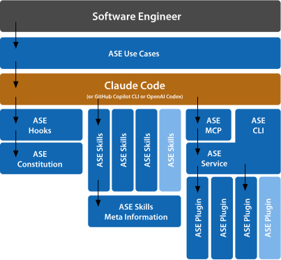

Agentic Software Engineering
============================

https://ase.tools

About
-----

**Agentic Software Engineering (ASE)** is the opinionated companion
tooling of *Dr. Ralf S. Engelschall* for combining the approach of
*Agentic AI* into *Software Engineering* with the help of *Agentic
AI Coding Tools* like *Claude Code*. **ASE** primarily consists of a
*Claude Code* plugin and a Command-Line Interface (CLI) tool. **ASE**
provides skills and commands to support the most important, recurring
work-steps in the primary disciplines of *Software Engineering*,
especially in the discipline *Software Development*.

> [!NOTE]
> **ASE** is *agentic*, but not pure *agent*-based, i.e., it focuses
> on supporting the role of a software engineer with *Agentic AI* and
> not driving the disciple software engineering with fully autonomous
> agents.

> [!NOTE]
> The initial, primary focus of **ASE** is on the tool *Claude Code* and
> the *TypeScript/JavaScript* technology stack, but the forthcoming,
> secondary focus will be also the tool *Github Copilot CLI* and the
> *Java* technology stack.

> [!CAUTION]
> **ASE** is still under heavy development, still incomplete, partially
> broken and hence not ready for production use. If you are not a
> hard-boiled early adopter, please visit this project again, once we
> reached at least version 0.9.x!

Features
--------

**ASE** provides the following four distinct features:

- **Configuration Scopes** (100% done):
  Parameters of project and agent can be configured on the hierarchy of
  the scopes *user*, *project*, *task*, and *skill*. This allows
  the flexible configuration of **ASE**.

- **Session Constitution** (80% done):
  All agent sessions have a "constitution" preloaded all the time, based
  on the configured parameters. This allows to control the *general*
  agent behavior.

- **Task Skills** (30% done):
  Recurring tasks are supported with dedicated skills, based on the
  configured parameters. This allows to control the *specific* agent
  behavior.

- **Context Gathering** (0% done):
  The agent context is loaded with individual information for all
  particular tasks. This allows the agent to more precisely perform the
  tasks.

User Setup
----------

### Installation

```
#   install ASE tool
npm install -g @rse/ase
```

```
#   install ASE plugin
claude plugin marketplace add rse/ase
claude plugin install ase@ase
```

### Update

```
#   update ASE tool
npm update -g @rse/ase
```

```
#   update ASE plugin
claude plugin marketplace update ase
claude plugin update ase@ase
```

### Uninstallation

```
#   uninstall ASE tool
npm uninstall -g @rse/ase
```

```
#   uninstall ASE plugin
claude plugin uninstall ase@ase
claude plugin marketplace remove ase
```

<details>

<summary>Contributor Setup</summary>

Contributor Setup
-----------------

### Initial Setup

```
#   clone repository
git clone https://github.com/rse/ase
cd ase

#   build tool
(cd tool && npm install && npm start build)

#   install tool call wrapper
mkdir -p $HOME/bin
(echo "#!/bin/sh"; echo "exec node `pwd`/tool/dst/ase.js \${1+\"$@\"}") >$HOME/bin/ase
chmod 755 $HOME/bin/ase

#   install plugin
claude plugin marketplace add `pwd`
claude plugin install ase@ase
```

### Upgrade Setup (after foreign changes)

```
#   update repository (but keep local modifications)
git stash
git pull
git stash pop

#   re-build tool
(cd tool && npm install && npm start build)

#   re-install plugin
claude plugin uninstall ase@ase
claude plugin install ase@ase
```

### Update Setup (after own local changes)

```
#   re-build tool
(cd tool && npm install && npm start build)

#   re-install plugin
claude plugin uninstall ase@ase
claude plugin install ase@ase
```

</details>

Overview
--------

**ASE** consists of various building blocks:



**ASE** especially provides the following four aspects:

-   **Plugin**: a plugin with hooks, skills, commands, etc.
-   **Tool**: a companion tool with commands, sub-commands, plugins, etc., for the plugin.
-   **Artifacts**: a definition of artifacts with structure, etc., for the plugin and tool.
-   **Templates**: a set of project skeletons with modules, etc., based on the artifacts, for the tool.

Usage
-----

### Meta Commands

The following ASE commands/skills exist on the meta-level:

- **/ase-meta-task** *task-id*:<br/>
  Get or set the unique ASE task id for the current session. Without an
  argument, displays the current task id. With an argument, sets the
  task id (persisted in the session-scoped configuration).

- **/ase-meta-why** *fact*:<br/>
  Perform a Five-Whys root-cause analysis.

- **/ase-meta-search** *query*:<br/>
  Search the Internet/Web with a query.

- **/ase-meta-quorum** *question*:<br/>
  Query multiple AIs for a quorum answer.

- **/ase-meta-llm** *llm* *query*:<br/>
  Query a foreign LLM like OpenAI ChatGPT, Google Gemini, DeepSeek or
  xAI Grok.

### Spec Commands

The following ASE commands/skills exist on the specification-level:

- **/ase-spec-preflight** *feature-id*:<br/>
  Preflight a stand-alone feature specification.

- **/ase-spec-edit** *feature-id* *summary-or-change*:<br/>
  Edit a stand-alone feature specification.

- **/ase-spec-implement** *feature-id*:<br/>
  Implement a stand-alone feature specification.

### Code Commands

The following ASE commands/skills exist on the code-level:

- **/ase-code-craft** *feature*:<br/>
  Craft source code from scratch.

- **/ase-code-changes**:<br/>
  Update changes entries in `CHANGELOG.md` files from Git commit information.

- **/ase-code-insight**:<br/>
  Give insights into the project.

- **/ase-code-explain** *source-reference*:<br/>
  Explain code with visual diagrams and analogies.

- **/ase-code-analyze** *source-reference*:<br/>
  Analyze the source code for problems in the logic and semantics and
  its related control flow. Usually, for each reported problem you want
  to elaborate on it with **/ase-code-elaborate**.

- **/ase-code-elaborate** *problem-reference*:<br/>
  Elaborate on a source code problem in depth to fix it. Usually the
  problem reference is one of the outputs of **/ase-code-analyze**.

- **/ase-code-refactor** *refactor-hint*:<br/>
  Refactor source code.

- **/ase-code-commit**:<br/>
  Determine commit message for staged Git changes.

- **/ase-code-lint** *source-reference*:<br/>
  Lint the source code in an interactive review loop.

    - **/ase-code-lint:nope**:<br/>
      During lint: reject the last proposed code change and continue
      with the review.

    - **/ase-code-lint:explain** *issue*:<br/>
      During lint: ask the assistant to improve its explanation of the
      last proposed code change.

    - **/ase-code-lint:reassess** *question*:<br/>
      During lint: ask the assistant to re-assess and reason on its
      last proposed code change.

    - **/ase-code-lint:refine** *hint*:<br/>
      During lint: ask the assistant to refine its last proposed code
      change.

    - **/ase-code-lint:complete**:<br/>
      During lint: tell the assistant that its last proposed code change
      set was not complete and ask it to re-propose the entire change set.

    - **/ase-code-lint:recheck**:<br/>
      During lint: tell the assistant that the source code was updated
      externally and ask it to re-propose its last code change against
      the latest source code.

Classification System
---------------------

In **ASE**, the following classification system can be configured on
the following scopes (and in this order, with later scopes overriding
earlier scopes):

-   `default`: (id: *none*,            storage: *built-in*)
-   `user`:    (id: `$USER`,           storage: `~/.ase/config.yaml`)
-   `project`: (id: `$ASE_PROJECT_ID`, storage: `.ase/config.yaml`)
-   `task`:    (id: `$ASE_TASK_ID`,    storage: `.ase/task/<task-id>/config.yaml`)
-   `session`: (id: `$ASE_SESSION_ID`, storage: `~/.ase/session/<session-id>/config.yaml`)

### Project Classification

-   **project.source.ambition**: the project *source code* has to meet the ambition of a...

    -   `artist`:    ...artist: finest code quality, individual, love for details.
    -   `craftsman`: ...craftsman: good code quality, individual, pragmatism.
    -   `engineer`:  ...engineer: medium code quality, standardized, pre-fabricated.

-   **project.source.boxing**: the project *source code* is treated as a...

    -   `white`:     ...white box, i.e., the code is intentially fully transparent and understood.
    -   `grey`:      ...grey  box, i.e., the code is intentially partially intransparent or not understood.
    -   `black`:     ...black box, i.e., the code is intentially fully intransparent and not understood.

-   **project.source.size**: the project *source code* is...

    -   `small`:     ...for a small-size tool (smaller than 10K LoC).
    -   `medium`:    ...for a medium-size application (larger than 10K LoC).
    -   `large`:     ...for a large-size system (larger than 100K LoC).

-   **project.source.structure**: the project *source code* is based on...

    -   `bare`:      ...bare code (no reusable components).
    -   `library`:   ...the use of libraries (reusable components).
    -   `framework`: ...the use of frameworks (standard structure).

-   **project.process.actors**: the project *process* is driven by a...

    -   `person`:    ...single person is acting.
    -   `team`:      ...team of persons (with or without their personal supporting asssitants
                     and agents) is collaboratively acting.
    -   `crew`:      ...mixed crew of both persons and robots/agents is collaboratively acting.

-   **project.process.drive**: the project *process* progress is mainly driven by...

    -   `spec`:      ...specification (spec-driven development).
    -   `code`:      ...code (code-driven development).
    -   `test`:      ...tests (test-driven development).

-   **project.result.target**: the project *result* target is a...

    -   `prototype`: ...prototype (not in target technology, short life-time, 5% solution).
    -   `mvp`:       ...Minimum Viable Product (in target technology, short life-time, 10-90% solution)
    -   `product`:   ...product (in target technology, long life-time, 100% solution)

### Project Artifacts

Each artifact key is a [Minimatch](https://github.com/isaacs/minimatch)
glob pattern, evaluated relative to the project base directory:

-   **project.artifact.build**: glob pattern matching the project *build-time artifact* files.
-   **project.artifact.code**: glob pattern matching the project *source code* files.
-   **project.artifact.docs**: glob pattern matching the project *documentation* files.
-   **project.artifact.spec**: glob pattern matching the project *specification* files.
-   **project.artifact.arch**: glob pattern matching the project *architecture* files.

### Agent Classification

-   **agent.persona.style**: the Agentic AI *persona* has the communication style of a...
    -    `writer`:      ...writer: decorative, eloquent, and explaining.
    -    `engineer`:    ...engineer: brief, factual and accurate.
    -    `telegrapher`: ...telegrapher: very brief, factual, and abbreviating.
    -    `caveman`:     ...caveman: ultra brief, rough and stuttering.

-   **agent.persona.creativity**: the Agentic AI *persona* shows...
    -    `none`:        ...none creativity and is just fact-based.
    -    `lite`:        ...lite creativity and is combining existing facts.
    -    `full`:        ...full creativity and is discovering new facts.

-   **agent.process.autonomy**: the Agentic AI *process* is characterized by the AI acting as...
    -    `assistant`:   ...an assistant: goal given, plan given, short-running, Human-in-the-Loop (HitL).
    -    `hotl`:        ...an semi-autonomous agent: goal given, plan found, short-running, Human-over-the-Loop (HotL)
    -    `agent`:       ...an autonomous agent: goal given, plan found, long-running, no human interaction

See Also
--------

- [claudeX](https://github.com/rse/claudex) (convenience wrapper for Claude Code)

Support
-------

**ASE** is developed in the experience context of industrial Software
Engineering at the [*msg group*](https://www.msg.group) and in the
educational context of the *Software Engineering Academy (SEA)*. **ASE**
development is supported by *msg Research* and *Software Engineering
Academy (SEA)*.

Copyright & License
-------------------

Copyright &copy; 2025-2026 [Dr. Ralf S. Engelschall](https://engelschall.com)<br/>
Licensed under [GPL 3.0](https://spdx.org/licenses/GPL-3.0-only)

