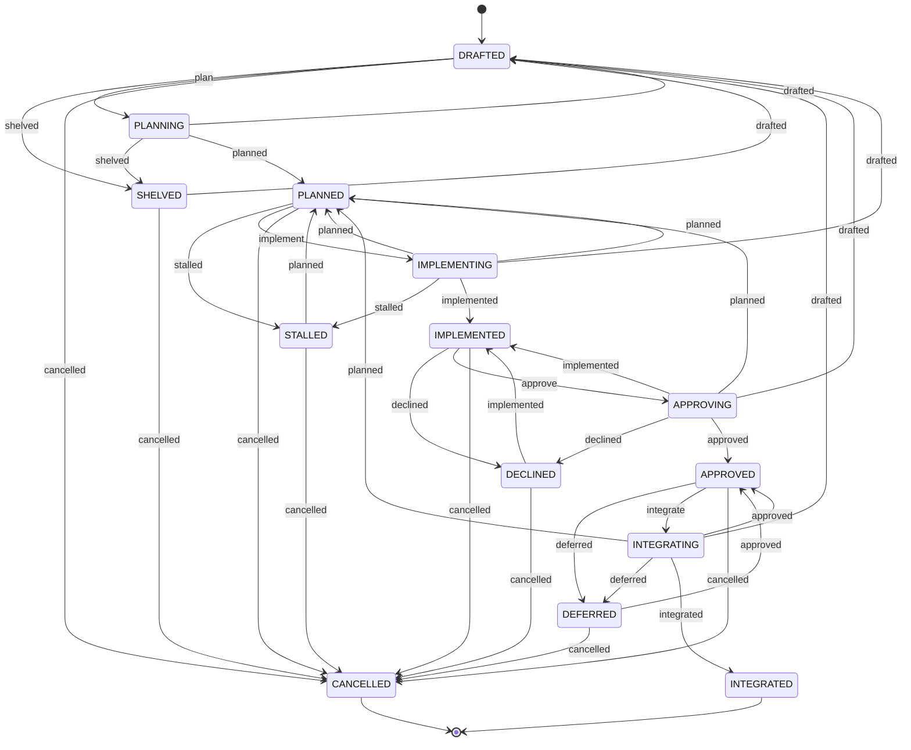

Task States
===========

Every **ASE** *task plan* carries a `Status` frontmatter key stating its current
*lifecycle state*. The key is optional and defaults to `DRAFTED`. The eight
states and the transitions between them form the following state machine which
realizes a full-blown agentic development pipeline based on the four phases
Planning, Implementation, Acceptance and Integration:



```txt
                     ●
                     │
                     ▼     ┌────────────────────────────────────┐
              ┌──────────────┐   shelved   ┌──────────────┐     │
    ┌────────▶│   DRAFTED    ├────────────▶│   SHELVED    ├─────┤
    │ drafted │              │◀────────────┤              │     │
    │         └──┬───────▲───┘   drafted   └──────▲───────┘     │
    │       plan │       │ drafted                │ shelved     │
    │            ▼       │                        │             │
    │         ┌──────────┴───┐                    │             │
    │         │!  PLANNING  !├────────────────────┘             │
    │         └──────┬───────┘                                  │
    │                │ planned                                  │
    │                ▼     ┌────────────────────────────────────┤
    │         ┌──────────────┐   stalled   ┌──────────────┐     │
    ├────────▶│   PLANNED    ├────────────▶│   STALLED    ├─────┤
    │ planned │              │◀────────────┤              │     │
    │         └──┬───────▲───┘   planned   └──────▲───────┘     │
    │  implement │       │ planned                │ stalled     │
    │            ▼       │                        │             │
    │         ┌──────────┴───┐                    │             │
    ├─────────┤!IMPLEMENTING!├────────────────────┘             │
    │         └──────┬───────┘                                  │
    │                │ implemented                              │
    │                ▼     ┌────────────────────────────────────┤
    │         ┌──────────────┐  declined   ┌──────────────┐     │
    │         │ IMPLEMENTED  ├────────────▶│   DECLINED   ├─────┤
    │         │              │◀────────────┤              │     │
    │         └──┬───────▲───┘ implemented └──────▲───────┘     │
    │    approve │       │ implemented            │ declined    │
    │            ▼       │                        │             │
    │         ┌──────────┴───┐                    │             │
    ├─────────┤! APPROVING  !├────────────────────┘             │
    │         └──────┬───────┘                                  │
    │                │ approved                                 │
    │                ▼     ┌────────────────────────────────────┤
    │         ┌──────────────┐  deferred   ┌──────────────┐     │
    │         │   APPROVED   ├────────────▶│   DEFERRED   ├─────┤
    │         │              │◀────────────┤              │     │
    │         └──┬───────▲───┘  approved   └──────▲───────┘     │
    │  integrate │       │ approved               │ deferred    │
    │            ▼       │                        │             │
    │         ┌──────────┴───┐                    │             │
    └─────────┤!INTEGRATING !├────────────────────┘             │
              └──────┬───────┘                                  │
                     │ integrated                  ┌────────────┘
                     ▼                             ▼ cancelled
              ┌──────────────┐             ┌──────────────┐
              │  INTEGRATED  │             │  CANCELLED   │
              └──────┬───────┘             └──────┬───────┘
                     └─────────────┬──────────────┘
                                   │
                                   ▼
                                   ◉
```

The four "activity" states express:

-   **PLANNING**:     task is currently in change planning       (idea to plan).
-   **IMPLEMENTING**: task is currently in change implementation (plan to change-set).
-   **APPROVING**:    task is currently in change approval       (change-set to decision).
-   **INTEGRATING**:  task is currently in change integration    (change-set to code-base).

The ten "rest" states express:

-   **DRAFTED**:      task is still provisional, non-coherent and non-complete.
-   **SHELVED**:      task was shelved into backlog.
-   **PLANNED**:      task is coherent and complete and ready for implementation.
-   **STALLED**:      task stalled during implementation by an impediment.
-   **IMPLEMENTED**:  task is implemented and is ready for approval.
-   **DECLINED**:     task was declined during approval.
-   **APPROVED**:     task is approved and ready for integration.
-   **DEFERRED**:     task was deferred during integration due to release decision.
-   **INTEGRATED**:   task is integrated and reached its intended outcome.
-   **CANCELLED**:    task was cancelled at any time, because it failed, was called off, or became obsolete.

A single operation may traverse *several* transitions at once if it
performs the corresponding stages in one go: `/ase-task-implement` moves
a plan to `IMPLEMENTED` via `implement` and `implemented`, for instance.

`/ase-task-list` filters by these states through its `--include` and
`--exclude` options, hiding the two terminal states `INTEGRATED` and
`CANCELLED` by default.

