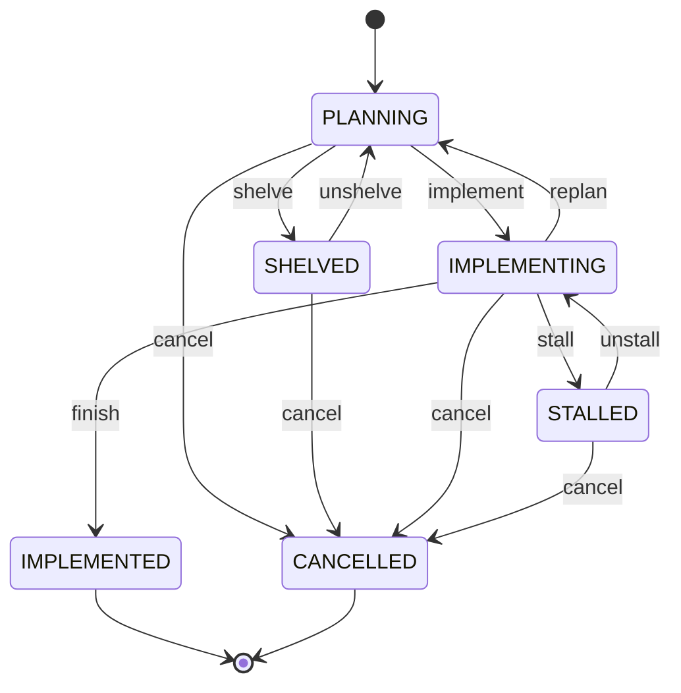
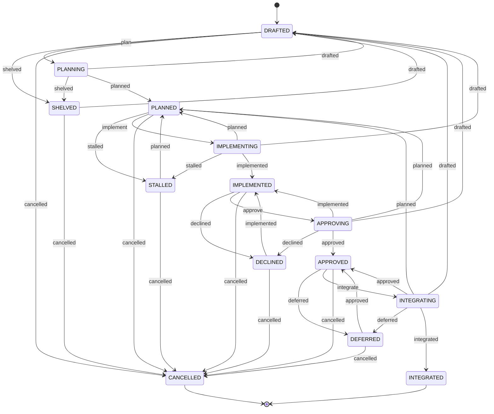

Task States
===========

Every **ASE** *task plan* carries an optional `Status` frontmatter key stating its current
*lifecycle state*. A single operation may traverse *several* transitions at once if it performs the
corresponding stages in one go. ASE pre-defines two reusable lifecycle models.

Simple Task Lifecycle Model
---------------------------

The 2+4 states and the transitions between them form the following state machine which realizes a
simple task management scheme.



```txt
              ●
              │
              ▼
        ┏━━━━━━━━━━━━┓  shelve   ┌────────────┐
┌──────▶┃  PLANNING  ┃──────────▶│  SHELVED   │
│replan ┃            ┃◀──────────│            │
│       ┗━━━━━━━━━━━━┛ unshelve  └────────────┘
│             │    │                   │
│    implement│    └───────────────────┴───────────┐
│             │                                    │
│             ▼                                    │
│       ┏━━━━━━━━━━━━┓  stall    ┌────────────┐    │
└───────┃IMPLEMENTING┃──────────▶│  STALLED   │    │
        ┃            ┃◀──────────│            │    │
        ┗━━━━━━━━━━━━┛  unstall  └────────────┘    │
              │    │                   │           │
        finish│    └───────────────────┴───────────┤
              ▼                              cancel│
        ┌────────────┐           ┌────────────┐    │
        │IMPLEMENTED │           │ CANCELLED  │◀───┘
        │            │           │            │
        └────────────┘           └────────────┘
              │                        │
              ├────────────────────────┘
              │
              ▼
              ◉
```

The 2 "activity" states express:

-   **PLANNING**:     task is being planned and is not yet cleared for implementation.
-   **IMPLEMENTING**: task is being implemented and is not yet completed.

The 4 "rest" states express:

-   **SHELVED**:      task was shelved into backlog.
-   **STALLED**:      task stalled during implementation by an impediment.
-   **IMPLEMENTED**:  task was implemented and reached its intended outcome.
-   **CANCELLED**:    task was cancelled at any time, because it failed, was called off, or became obsolete.

Complex Task Lifecycle Model
----------------------------

The 4+10 states and the transitions between them form the following state machine which realizes
a full-blown agentic development pipeline based on the four phases Planning, Implementation,
Acceptance and Integration:



```txt
                     ●
                     │
                     ▼     ┌────────────────────────────────────┐
              ┌──────────────┐   shelved   ┌──────────────┐     │
    ┌────────▶│   DRAFTED    │────────────▶│   SHELVED    │─────┤
    │ drafted │              │◀────────────│              │     │
    │         └──────────────┘   drafted   └──────────────┘     │
    │       plan │       ▲                        ▲ shelved     │
    │            ▼       │ drafted                │             │
    │         ┏━━━━━━━━━━━━━━┓                    │             │
    │         ┃   PLANNING   ┃────────────────────┘             │
    │         ┗━━━━━━━━━━━━━━┛                                  │
    │                │ planned                                  │
    │                ▼     ┌────────────────────────────────────┤
    │         ┌──────────────┐   stalled   ┌──────────────┐     │
    ├────────▶│   PLANNED    │────────────▶│   STALLED    │─────┤
    │ planned │              │◀────────────│              │     │
    │         └──────────────┘   planned   └──────────────┘     │
    │  implement │       ▲                        ▲ stalled     │
    │            ▼       │ planned                │             │
    │         ┏━━━━━━━━━━━━━━┓                    │             │
    ├─────────┃ IMPLEMENTING ┃────────────────────┘             │
    │         ┗━━━━━━━━━━━━━━┛                                  │
    │                │ implemented                              │
    │                ▼     ┌────────────────────────────────────┤
    │         ┌──────────────┐  declined   ┌──────────────┐     │
    │         │ IMPLEMENTED  │────────────▶│   DECLINED   │─────┤
    │         │              │◀────────────│              │     │
    │         └──────────────┘ implemented └──────────────┘     │
    │    approve │       ▲                        ▲ declined    │
    │            ▼       │ implemented            │             │
    │         ┏━━━━━━━━━━━━━━┓                    │             │
    ├─────────┃  APPROVING   ┃────────────────────┘             │
    │         ┗━━━━━━━━━━━━━━┛                                  │
    │                │ approved                                 │
    │                ▼     ┌────────────────────────────────────┤
    │         ┌──────────────┐  deferred   ┌──────────────┐     │
    │         │   APPROVED   │────────────▶│   DEFERRED   │─────┤
    │         │              │◀────────────│              │     │
    │         └──────────────┘  approved   └──────────────┘     │
    │  integrate │       ▲ approved               ▲ deferred    │
    │            ▼       │                        │             │
    │         ┏━━━━━━━━━━━━━━┓                    │             │
    └─────────┃ INTEGRATING  ┃────────────────────┘             │
              ┗━━━━━━━━━━━━━━┛                        cancelled │
                     │ integrated                 ┌─────────────┘
                     ▼                            ▼
              ┌──────────────┐             ┌──────────────┐
              │  INTEGRATED  │             │  CANCELLED   │
              └──────────────┘             └──────────────┘
                     │                            │
                     └─────────────┬──────────────┘
                                   │
                                   ▼
                                   ◉
```

The 4 "activity" states express:

-   **PLANNING**:     task is currently in change planning       (idea to plan).
-   **IMPLEMENTING**: task is currently in change implementation (plan to change-set).
-   **APPROVING**:    task is currently in change approval       (change-set to decision).
-   **INTEGRATING**:  task is currently in change integration    (change-set to code-base).

The 10 "rest" states express:

-   **DRAFTED**:      task is still provisional, non-coherent and non-complete.
-   **SHELVED**:      task was shelved into backlog.
-   **PLANNED**:      task is coherent and complete and ready for implementation.
-   **STALLED**:      task stalled during implementation by an impediment.
-   **IMPLEMENTED**:  task is implemented and is ready for approval.
-   **DECLINED**:     task was declined during approval.
-   **APPROVED**:     task is approved and ready for integration.
-   **DEFERRED**:     task was deferred during integration due to release decision.
-   **INTEGRATED**:   task is integrated and reached its intended outcome.
-   **CANCELLED**:    task was cancelled at any time, because it failed, was called off, or became obsolete.
