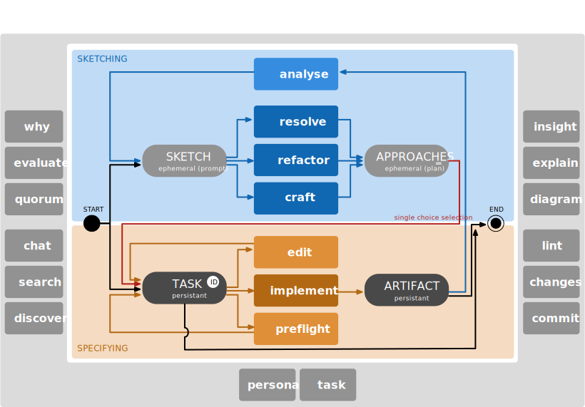

Usage of Plugin
===============

### Meta Commands

The following ASE commands/skills exist on the meta-level:

- **/ase-meta-search** *query*: 
  Search the Internet/Web with a query.

- **/ase-meta-chat** *llm* *query*: 
  Query a foreign LLM like OpenAI ChatGPT, Google Gemini, DeepSeek or
  xAI Grok.

- **/ase-meta-quorum** *question*: 
  Query multiple AIs for a quorum answer.

- **/ase-meta-why** *fact*: 
  Perform a Five-Whys root-cause analysis.

- **/ase-meta-evaluate** *alternatives*: 
  Evaluate alternatives through an ad-hoc weighted multi-criteria
  decision matrix.

- **/ase-meta-persona** \[*persona*\]: 
  Adjust communication style in four intensity levels of token usage.
  The *persona* can be either a decorative, eloquent, and explaining
  `writer`, a brief, factual, and accurate `engineer` (default), a
  very brief, factual, and abbreviating `telegrapher`, or an ultra
  brief, rough and stuttering `caveman`.

- **/ase-meta-changes**: 
  Update changes entries in `CHANGELOG.md` files from Git commit information.

- **/ase-meta-commit**: 
  Determine commit message for staged Git changes.

### Architecture Commands

The following ASE commands/skills exist on the architecture-level:

- **/ase-arch-discover** *functionality*: 
  Discover additional, third-party components (libraries/frameworks)
  for the technology stack to provide needed functionality.

- **/ase-arch-analyze** *source-reference*: 
  Review the software architecture.

### Task Commands

The following ASE commands/skills exist on the task-level:

- **/ase-task-id** \[*id*\]: 
  Get or set the unique ASE task id for the current session. Without an
  argument, displays the current task id. With an argument, sets the
  task id (persisted in the session-scoped configuration).

- **/ase-task-list**: 
  List all available persisted task ids.

- **/ase-task-edit** \[*id*\]: 
  Iteratively craft and refine a named task plan through a
  conversational loop, without using *Claude Code Plan Mode*.

- **/ase-task-view** \[*id*\]: 
  View the current or given task plan.

- **/ase-task-rename** \[*id*\]: 
  Rename the current or given task plan to a new id.

- **/ase-task-reboot** \[*id*\]: 
  Reboot the current or given task plan by crafting it from scratch.

- **/ase-task-preflight** \[*id*\]: 
  Preflight the implementation of the current or given task plan.

- **/ase-task-implement** \[*id*\]: 
  Implement the current or given task plan.

- **/ase-task-delete** \[*id*\]: 
  Delete the current or given task plan.

### Code Commands

The following ASE commands/skills exist on the code-level:

- **/ase-code-craft** *feature*: 
  Craft source code from scratch.

- **/ase-code-insight**: 
  Give insights into the project.

- **/ase-code-explain** *source-reference*: 
  Explain code with visual diagrams and analogies.

- **/ase-code-analyze** *source-reference*: 
  Analyze the source code for problems in the logic and semantics and
  its related control flow. Usually, for each reported problem you want
  to resolve it with **/ase-code-resolve**.

- **/ase-code-resolve** *problem*: 
  Resolve a problem in depth in order to fix it. Usually the
  problem reference is one of the outputs of **/ase-code-analyze**.

- **/ase-code-refactor** *refactor-hint*: 
  Refactor source code.

- **/ase-code-lint** *source-reference*: 
  Lint the source code in an interactive review loop.

### Documentation Commands

The following ASE commands/skills exist on the documentation-level:

- **/ase-docs-proofread** *docs-reference*: 
  Analyze the documents for spelling, punctuation, or grammar errors
  and immediately correct all found problems.

