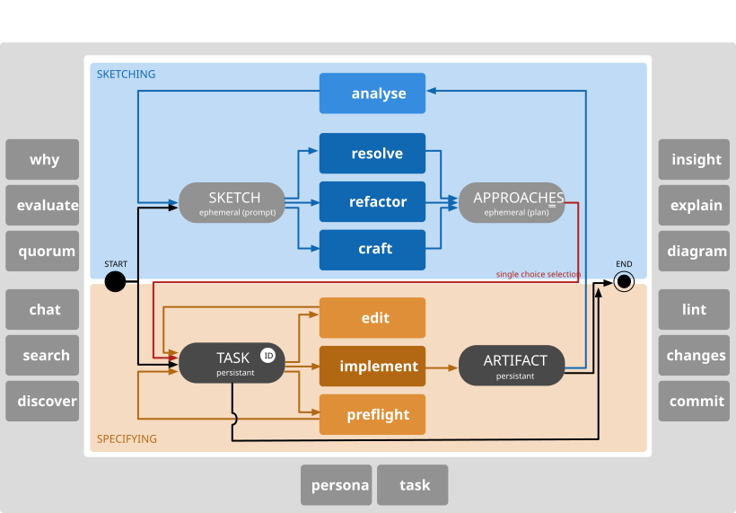

Usage of Plugin
===============

### Output Style

The plugin ships the output style `ase-terse` (`output-styles/ase-terse.md`), which
lets the agent respond tersely: leading with the result, executing tools
silently, skipping preamble, narration, and closing recaps, and
selecting the formatting by intent. Under *Anthropic Claude Code CLI* it
is a regular plugin output style, selected by `ase setup install` and
switchable via `/config`. Under *GitHub Copilot CLI* and *OpenAI Codex
CLI*, which have no output style concept, its instructions are injected
into the session context by the session-start hook instead.

### Meta Commands

The following ASE commands/skills exist on the meta-level:

- **/ase-meta-brainstorm** \[`--max-clarify`|`-c` *num*\] \[`--min-ideas`|`-i` *num*\] \[`--min-rank`|`-r` *num*\] \[`--max-shortlist`|`-s` *num*\] *topic*: 
  Collaboratively brainstorm a topic by clarifying intent, diverging
  into a broad space of candidate ideas, then converging through
  clustering and scoring into a shortlist with a single recommended
  direction. Helps figure out *what* to build before *how* to build it.
  `--max-clarify` bounds the number of clarifying questions, `--min-ideas`
  the number of candidate ideas to diverge into, `--min-rank` the number
  of ideas to score, and `--max-shortlist` the size of the converged
  shortlist.

- **/ase-meta-search** \[`--services`|`-s` `all`|`perplexity`|`brave`|`exa`|`websearch`\] *query*: 
  Search the Internet/Web with a query. The `--services` option (repeatable)
  restricts which search backends are consulted (default: all available).

- **/ase-meta-chat** *llm* *query*: 
  Query a foreign LLM like OpenAI ChatGPT, Google Gemini, DeepSeek or
  xAI Grok.

- **/ase-meta-quorum** \[`--models`|`-m` *model*\[,...\]\] *question*: 
  Query multiple AIs for a quorum answer. The `--models` option selects
  the comma-separated set of models to poll.

- **/ase-meta-why** \[`--depth`|`-d` *N*\] \[`--width`|`-w` *M*\] *fact*: 
  Perform a Five-Whys root-cause analysis. `--depth` sets the number of
  successive *why* levels and `--width` the number of parallel causes
  explored per level.

- **/ase-meta-evaluate** *alternatives*: 
  Evaluate alternatives through an ad-hoc weighted multi-criteria
  decision matrix.

- **/ase-meta-diaboli** \[`--count`|`-c` *count*\] *thesis*: 
  Challenge a thesis by relentlessly playing *Devil's Advocate* (Latin:
  *Advocatus Diaboli*), then derive a *Hegelian* synthesis. `--count`
  sets the number of counter-arguments raised.

- **/ase-meta-steelman** \[`--count`|`-c` *count*\] \[`--rounds`|`-r` *rounds*\] *thesis*: 
  Strengthen a thesis by building the strongest possible *Steelman* case
  for it, then derive a fortification. `--count` sets the number of
  supporting arguments and `--rounds` the number of fortification rounds.

- **/ase-meta-config** \[`--scope`|`-s` *scope*\] *operation* \[*args*\]: 
  List, get, set, or delete the values of the layered *ASE*
  configuration, mirroring the non-interactive `ase config` subcommands
  through the `ase` MCP server. The *operation* is `list`, `get` *key*,
  `set` *key* *value*, or `delete` *key*. `--scope` selects the scope
  chain (`user`, `project`, `task:`*id*, `session:`*id*); without it the
  current session's chain is used, so that reads see the full cascade and
  writes land on the session layer. This especially adjusts the
  communication style through `agent.persona`, which has five intensity
  levels of token usage: a decorative, eloquent, and explaining `writer`,
  a brief, factual, and accurate `engineer` (default), a layered,
  pyramid-structured `journalist`, a very brief, factual, and abbreviating
  `telegrapher`, or an ultra brief, rough and stuttering `caveman`.

- **/ase-meta-changelog**: 
  Update ChangeLog entries in `CHANGELOG.md` files from Git commit information.

- **/ase-meta-commit**: 
  Determine commit message for staged Git changes.

- **/ase-meta-diff** \[`--coherence`|`-c`\] \[`--risk`|`-r`\] \[`--blast`|`-b`\]: 
  Summarize the staged Git changes as a human-readable, intent-grouped
  narrative. With `--coherence`, additionally reconstruct the single
  intended change and flag hunks that do not serve it. With `--risk`,
  additionally grade the diff against a
  coupling/criticality/coverage/reversibility rubric and emit a banded
  risk report with mitigations. With `--blast`, additionally render a
  blast-radius map of the touched modules and their reverse dependencies.

- **/ase-meta-review** \[`--severity`|`-S` `LOW`|`MEDIUM`|`HIGH`\]: 
  Perform a holistic, human-reviewer-style critique of the currently
  staged Git changes and emit an approve/reject verdict with
  prioritized, severity-tagged, line-cited findings. `--severity` sets
  the minimum severity of findings to report.

- **/ase-meta-mint** \[`--type`|`-t` `uuid`|`sha1`|`const`|`var`|`class`|`func`|`path`|`name`\] \[`--count`|`-c` *count*\] \[*hint*\]: 
  Mint an identifier or a name of the requested type out of a free-text
  *hint*. The hash-derived types `uuid` (a deterministic *UUID V5* within
  the fixed *ASE* namespace, or a random *UUID V4* without a *hint*) and
  `sha1` (the hexadecimal *SHA-1* digest) are delegated to the `ase_mint`
  tool of the `ase` MCP server, while the linguistic types `const`
  (`FOO_BAR_QUUX`), `var` (`fooBarQuux`, substantive last part), `func`
  (`fooBarQuux`, verb first part), `class` (`FooBarQuux`), `path`
  (`foo-bar-quux`), and `name` (`FooBarQuux`, a product-like brand name)
  are derived by the skill itself. `--count` mints more than one
  identifier at once, which for the hash-derived types is possible for
  an empty *hint* only, as hashing a non-empty *hint* is deterministic
  and hence always yields exactly one identifier.

- **/ase-meta-compat**: 
  Run the *ASE* compatibility self-test, probing the agent harness and
  LLM for the control structures and placeholder handling *ASE* relies
  on and reporting the determined compatibility level.

### Architecture Commands

The following ASE commands/skills exist on the architecture-level:

- **/ase-arch-discover** \[`--limit`|`-l` *count*\] \[`--staleness`|`-s` *months*\] \[`--small-scope`|`-S`\] *functionality*: 
  Discover additional, third-party components (libraries/frameworks)
  for the technology stack to provide needed functionality. `--limit`
  caps the number of candidate components considered (default: `12`).
  `--staleness` sets the age threshold in months beyond which a
  component's last release incurs a staleness penalty (default: `18`).
  With `--small-scope`, a dependency-weight penalty favors
  smaller-footprint candidates.

- **/ase-arch-analyze** *source-reference*: 
  Review the software architecture.

### Task Commands

The following ASE commands/skills exist on the task-level:

- **/ase-task-id** \[*id*\]: 
  Get or set the unique ASE task id for the current session. Without an
  argument, displays the current task id. With an argument, sets the
  task id (persisted in the session-scoped configuration).

- **/ase-task-list** \[`--verbose`|`-v`\] \[`--include`|`-i` *state*\[,...\]\] \[`--exclude`|`-e` *state*\[,...\]\]: 
  List all available persisted task ids. With `--verbose`, each entry is
  annotated with its lifecycle state and last-modification timestamp.
  `--include` restricts the listing to the given lifecycle states of the
  configured task lifecycle model (`project.task.lifecycle`), `--exclude`
  removes the given states afterwards (default: `finished`). The
  `finished` sentinel stands for the finished states of the model, the
  `none` sentinel for no restriction.

- **/ase-task-edit** \[`--plan`|`-p` *option*\] \[`--dry`|`-d`\] \[`--next`|`-n` *option*\[,...\]\] \[*id* | *id*`:` *instruction* | *instruction*\]: 
  Iteratively craft and refine a named task plan through a
  conversational loop, without using *Anthropic Claude Code CLI Plan Mode*.
  `--plan` preselects a plan-editing option, `--dry` plans without
  persisting, and `--next` passes a comma-separated list of pre-selected
  next-step tokens to chain the subsequent skill. The positional argument
  may be a bare *id*, an *id* with an inline *instruction*, or an
  *instruction* alone.

- **/ase-task-grill** \[`--rounds`|`-r` *n*\] \[`--until`|`-u` `MUST`|`SHOULD`|`MAY`\] \[`--focus`|`-f` *section*\[,...\]\] \[`--next`|`-n` *option*\[,...\]\] \[*id*\]: 
  Relentlessly interview the user about every essential aspect of the
  task plan until a shared understanding is reached, asking up to 10
  focus-area-sorted (`DOMAIN`, `INTERFACE`, `ARCHITECTURE`,
  `IMPLEMENTATION`, `REGRESSION`, `CONFIRMATION`) questions
  sequentially, one at a time. `--rounds` sets the maximum number of
  grill rounds (default: `1`), each re-deriving its questions from the
  updated plan, and `--until` stops the grilling early once all open
  points of the given severity or higher are clear (default: `MUST`).
  `--focus` grills
  only the given plan sections (`SPECIFICATION`/`SPEC`, `DESIGN`/`DES`,
  `VERIFICATION`/`VER`, default: `all`), in the given order. `--next`
  passes a comma-separated list of pre-selected next-step tokens to
  chain the subsequent skill.

- **/ase-task-view** \[`--full`|`-f`\] \[*id*\]: 
  View the current or given task plan. With `--full`, the entire plan is
  shown without truncation.

- **/ase-task-status** \[*id*`:`\] \[*status*\]: 
  Get or set the lifecycle status (`Status:` frontmatter key) of the
  current or given task plan. Without *status*, the current status is
  reported. With *status* (a state of the configured task lifecycle
  model, case-insensitive), the status is set, leaving the `Modified:`
  key alone as it tracks body changes only. A status not reachable via
  one or more transitions of the model is rejected.

- **/ase-task-rename** \[*old-id*\] *new-id*: 
  Rename the current or given task plan to *new-id*. When *old-id* is
  omitted, the current task is renamed.

- **/ase-task-reboot** \[`--next`|`-n` *option*\[,...\]\] \[*id*\]: 
  Reboot the current or given task plan by crafting it from scratch.
  `--next` passes a comma-separated list of pre-selected next-step tokens
  to chain the subsequent skill.

- **/ase-task-preflight** \[`--next`|`-n` *option*\[,...\]\] \[*id*\]: 
  Preflight the implementation of the current or given task plan. The
  draft is based on the branch named by the plan's `Branch:` key (or
  `HEAD` if it does not exist yet) whenever it differs from the
  checked-out branch. `--next` passes a comma-separated list of
  pre-selected next-step tokens to chain the subsequent skill.

- **/ase-task-implement** \[`--next`|`-n` *option*\[,...\]\] \[`--worktree`|`-w`\] \[*id*\]: 
  Implement the current or given task plan. The plan's `Branch:` key
  selects the branch the change set lands on: a value differing from
  the checked-out branch switches the (clean) working copy to that
  branch in place, or, with `--worktree`, checks it out inside the
  dedicated Git worktree `.ase/worktree/<id>` (on an implied branch
  `<id>` if the plan targets the checked-out branch). `--next` passes
  a comma-separated list of pre-selected next-step tokens to chain the
  subsequent skill.

- **/ase-task-condense** \[`--next`|`-n` *option*\[,...\]\] \[*id*\]: 
  Condense the current or given task plan by compressing its wording
  without losing essential content. `--next` passes a comma-separated
  list of pre-selected next-step tokens to chain the subsequent skill.

- **/ase-task-delete** \[*id*\]: 
  Delete the current or given task plan.

### Code Commands

The following ASE commands/skills exist on the code-level:

- **/ase-code-craft** \[`--auto`|`-a`\] \[`--dry`|`-d`\] \[`--direct`|`-D`\] \[`--interactive`|`-i`\] \[`--quick`|`-Q`\] \[`--next`|`-n` *option*\[,...\]\] \[*task-id*`:`\] *feature*: 
  Craft source code from scratch. With `--auto`, the skill runs
  non-interactively without asking for confirmation. With `--dry`, it
  only plans without applying changes. With `--direct`, it skips the
  approach comparison and task plan ceremony entirely and directly
  applies the change set in place. With `--interactive`, it implies
  `--direct` and repeatedly asks for the next change, immediately
  applying each one in place. `--quick` is a shorthand that
  enables `--auto`, `--dry`, and a preselected `--next`. `--next` passes
  a comma-separated chronological list of pre-selected next-step tokens
  (out of `none`, `DONE`, `EDIT`, `PREFLIGHT`, `IMPLEMENT`) to chain the
  subsequent skill. An optional leading *task-id*`:` scopes the work to a
  persisted task plan.

- **/ase-code-insight**: 
  Give insights into the project.

- **/ase-code-explain** *source-reference*: 
  Explain code with visual diagrams and analogies.

- **/ase-code-analyze** \[`--performance`|`-p`\] \[`--security`|`-s`\] \[`--severity`|`-S` `LOW`|`MEDIUM`|`HIGH`\] *source-reference*: 
  Analyze the source code for problems in the logic and semantics and
  its related control flow. With `--performance`, additionally analyze
  performance and efficiency; with `--security`, additionally analyze
  security. `--severity` sets the minimum severity of findings to
  report. Usually, for each reported problem you want to resolve it with
  **/ase-code-resolve** or directly fix it with **/ase-code-edit**.

- **/ase-code-resolve** \[`--auto`|`-a`\] \[`--dry`|`-d`\] \[`--direct`|`-D`\] \[`--quick`|`-Q`\] \[`--next`|`-n` *option*\[,...\]\] \[*task-id*`:`\] *problem*: 
  Resolve a problem in depth in order to fix it. Usually the
  problem reference is one of the outputs of **/ase-code-analyze**. The
  `--auto`, `--dry`, `--direct`, `--quick`, `--next`, and *task-id*`:`
  options behave as for **/ase-code-craft**.

- **/ase-code-refactor** \[`--auto`|`-a`\] \[`--dry`|`-d`\] \[`--direct`|`-D`\] \[`--quick`|`-Q`\] \[`--next`|`-n` *option*\[,...\]\] \[*task-id*`:`\] *refactor-hint*: 
  Refactor source code. The `--auto`, `--dry`, `--direct`, `--quick`,
  `--next`, and *task-id*`:` options behave as for **/ase-code-craft**.

- **/ase-code-edit** \[`--mode`|`-m` `auto`|`craft`|`refactor`|`resolve`\] \[`--grill`|`-g`\] \[`--grill-rounds`|`-r` *n*\] \[`--grill-until`|`-u` `MUST`|`SHOULD`|`MAY`\] \[`--verify`|`-v`\] \[`--branch`|`-b` *name*\] \[`--worktree`|`-w`\] \[`--loop`|`-l`\] \[*query*\]: 
  Edit the code base directly from a *query* in a plan-less state
  machine (querying, discovering, grilling, implementing, verifying)
  which fuses **/ase-code-craft**, **/ase-code-refactor**,
  **/ase-code-resolve**, **/ase-task-grill**, and
  **/ase-task-implement**. `--mode` selects the internalized tenet set
  (`auto` infers it from the query). With `--grill`, the query is
  grilled with at most `--grill-rounds` rounds of questions before
  implementing, stopping early once all open points of severity
  `--grill-until` or higher are clear (default: `MUST`).
  With `--verify`, the implementation is verified until it passes;
  otherwise strictly no verification is performed. `--branch` names the
  branch the change sets land on, switching the (clean) working copy to
  it in place. With `--worktree`, all change sets land in one dedicated
  Git worktree on that branch. With `--loop`, the skill repeatedly asks
  for the next query until the user answers `STOP SKILL`.

- **/ase-code-lint** \[`--auto`|`-a`\] \[`--severity`|`-S` `LOW`|`MEDIUM`|`HIGH`\] \[`--include`|`-i` *aspect*\[,...\]\] \[`--exclude`|`-e` *aspect*\[,...\]\] *source-reference*: 
  Lint the source code in an interactive review loop. With `--auto`, the
  loop runs non-interactively. `--severity` sets the minimum severity of
  findings to report. `--include` and `--exclude` narrow the checked
  code quality aspects (`A01`...`A20`) to an effective set: `--include`
  alone keeps just the listed ones, `--exclude` alone keeps all others,
  and both together keep the included ones minus the excluded ones.

### Documentation Commands

The following ASE commands/skills exist on the documentation-level:

- **/ase-docs-shorten** \[`--auto`|`-a`\] (`--chars`|`-c` *N* | `--words`|`-w` *N*) *docs-reference*: 
  Shorten a single document until it reaches the target length given by
  the mutually exclusive, mandatory `--chars` or `--words` option, by
  running a three-stage cascade -- tighten the sentences, drop low-value
  content, compress the remaining content into shorter expressions --
  entering each stage only while the target is still not met. Each
  proposed change is cut as a whole block and reviewed as a unified
  diff; with `--auto` all of them are applied unattended.

- **/ase-docs-refine** \[`--auto`|`-a`\] *docs-reference*: 
  Refine the sentence structure and style of the referenced documents:
  restructure sentences for rhythm and clarity, replace cumbersome
  nominal constructions with verbs, bring enumerations into one
  grammatical shape, cut filler and redundancy, fix awkward
  transitions, and adjust voice, while content, numbers, and technical
  terms stay exactly as they are. With `--auto` all proposed
  refinements are applied unattended.

- **/ase-docs-proofread** \[`--auto`|`-a`\] *docs-reference*: 
  Analyze the documents for spelling, punctuation, or grammar errors
  and immediately correct all found problems. With `--auto`, corrections
  are applied non-interactively.

- **/ase-docs-distill** \[`--top`|`-t` *N*\] *docs-reference*: 
  Distill a document into a flat, importance-ranked list of its key
  points, each with a salience rank, a rationale, and a verbatim
  line-cited evidence snippet. `--top` limits the output to the *N*
  highest-ranked points.

### Specification Commands

The following ASE commands/skills exist on the specification-level:

- **/ase-spec-activate** \[*query*\]: 
  Activate the know-how about the *SpecBook*-based specification (`SPEC`)
  in the current session: load the *SpecBook* format contract, read the
  *SpecBook* schema configuration of the project, and resolve the `SPEC`
  artifacts, reported in a `SPEC ACTIVATED` box. Afterwards the
  specification can be read, queried, explained, and ad-hoc edited in
  plain conversation, kept conformant to the format contract and
  validated via *SpecBook* linting. An optional *query* is answered
  directly after the activation; it mainly serves the automatic
  invocation, where the triggering request is passed through so that
  activation and answer happen in one skill run. The model invokes this
  skill automatically whenever the specification files are to be worked
  with outside of the dedicated specification skills, which activate
  the know-how implicitly.

- **/ase-spec-edit** \[`--grill`|`-g`\] \[`--grill-rounds`|`-r` *n*\] \[`--grill-until`|`-u` `MUST`|`SHOULD`|`MAY`\] \[`--verify`|`-v`\] \[`--branch`|`-b` *name*\] \[`--worktree`|`-w`\] \[`--loop`|`-l`\] \[*query*\]: 
  Edit the *SpecBook*-based specification (`SPEC`) directly from a
  *query* in a plan-less state machine (querying, discovering, grilling,
  implementing, verifying), the specification-level counterpart of
  **/ase-code-edit**. The change set stays strictly restricted to the
  `SPEC` artifacts and keeps them conformant to the *SpecBook* format
  contract, refreshing the `Modified:` timestamp of every changed file.
  With `--grill`, the query is grilled with at most `--grill-rounds`
  rounds of questions before implementing, stopping early once all open
  points of severity `--grill-until` or higher are clear (default:
  `MUST`). With `--verify`, the specification is
  validated via *SpecBook* linting and the diagnostics are fixed in at
  most three rounds; otherwise strictly no validation is performed.
  `--branch` names the branch the change sets land on, switching the
  (clean) working copy to it in place. With `--worktree`, all change
  sets land in one dedicated Git worktree on that branch. With
  `--loop`, the skill repeatedly asks for the next query until the user
  answers `STOP SKILL`.

### Synchronization Commands

The following ASE commands/skills exist on the synchronization-level:

- **/ase-sync-reconcile** \[`--bidirectional`|`-b`\] \[`--operation`|`-o` *op*\] \[`--dry`|`-d`\] \[`--target`|`-t` *target*\] \[`--source`|`-s` *source*\] \[*hint*\]: 
  Reconcile one set of artifact kinds (the *target*) so it reflects the
  current state of another set (the *source*), reading the source
  artifacts and surgically adjusting the target artifacts. Both *target*
  and *source* are comma-separated lists of the artifact kinds `TASK`,
  `SPEC`, `CODE`, `DOCS`, `INFR`, and `OTHR`; when *source* is
  omitted, it defaults to all remaining kinds not present in *target*.
  With `--bidirectional`, the alignment is performed in both directions.
  `--operation` restricts the applied target-side operations to a
  comma-separated subset of `add`, `update`, and `remove` (default:
  `all`), and `--dry` shows the intended changes as a unified diff
  instead of applying them. An optional *hint* narrows the scope of the
  reconciliation. Changed `SPEC` artifacts are validated via *SpecBook*
  linting.

- **/ase-sync-import** \[`--target`|`-t` *target*\] *hint*: 
  Import information from foreign sources (files, URLs, or pasted text)
  into a set of artifact kinds (the *target*), generating or updating
  them to reflect the imported information. The *target* is a
  comma-separated list of the artifact kinds `TASK`, `SPEC`,
  `CODE`, `DOCS`, `INFR`, and `OTHR`. Generated or updated `SPEC`
  artifacts are validated via *SpecBook* linting.

- **/ase-sync-export** \[`--output`|`-o` *output*\]: 
  Export the *SpecBook*-based specification (`SPEC`) into ready-to-consume
  renderings. The *output* is a comma-separated list of
  \[*format*`:`\]*file* entries with *format* one of `json`, `json5`,
  `yaml`, `toon`, `html`, `pdf`, or `md` (inferred from the filename
  extension unless prefixed); it defaults to the HTML rendering
  `index.html` inside the `SPEC` base directory.

