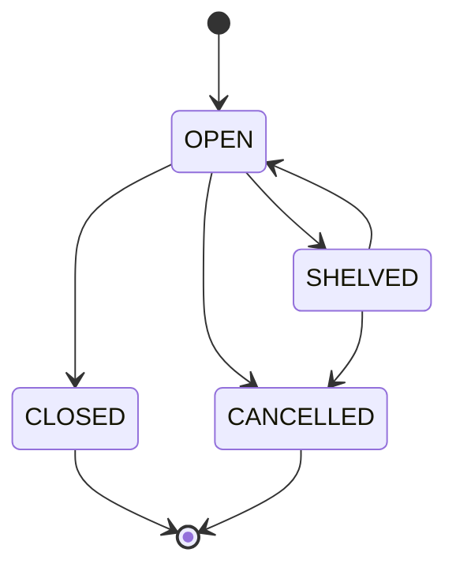
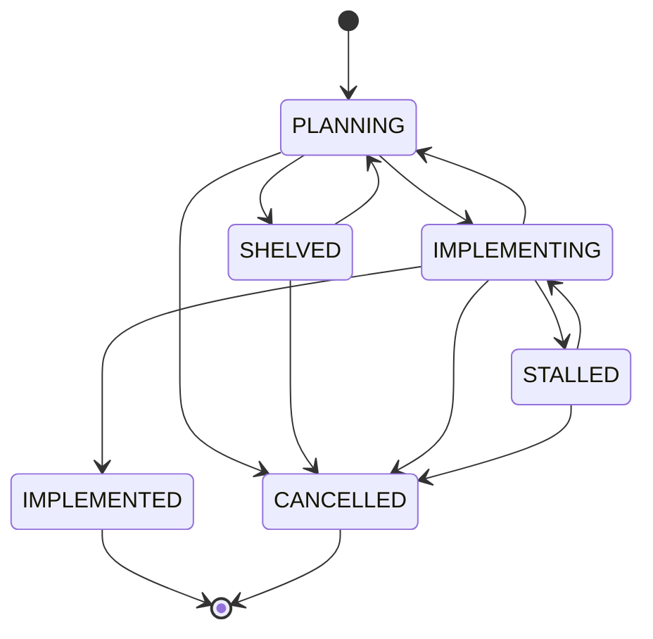
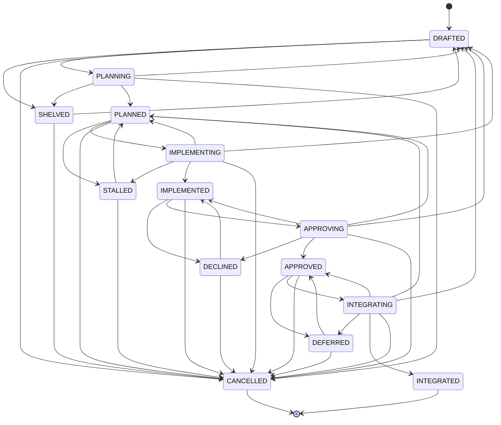

Task Format
-----------

Every *task* uses a strict and fixed textual format:

<format>
---
Type:     text/vnd.ase.task
Id:       <task-id/>
Created:  <timestamp-created/>
Modified: <timestamp-modified/>
Group:    <task-group/>
Phase:    <task-phase/>
After:    <task-after/>
Status:   <task-status/>
Assignee: <task-assigned/>
Kind:     <task-kind/>
Tags:     <task-tags/>
Branch:   <task-branch/>
---

#   TASK: <task-title/>

##  SPECIFICATION (WHAT)

-   [ ] DOM: **[...]**: [...]

-   [...]

-   [ ] IFC: **[...]**: [...]

-   [...]

##  DESIGN (HOW)

-   [ ] ARC: **[...]**: [...]

-   [...]

-   [ ] IMP: **[...]**: [...]

-   [...]

##  VERIFICATION (WHEN)

-   [ ] REG: **[...]**: [...]

-   [...]

-   [ ] CON: **[...]**: [...]

-   [...]

---
Type:     <task-attachment-type/>
Desc:     <task-attachment-desc/>
Created:  <task-attachment-created/>
Modified: <task-attachment-modified/>
Data:     |4+
    <task-attachment-payload/>
---
Type:     <task-attachment-type/>
Desc:     <task-attachment-desc/>
Created:  <task-attachment-created/>
Modified: <task-attachment-modified/>
File:     <task-attachment-file/>
</format>

You *MUST* honor the following hints on this *task* format:

-   A task consists of at least two blocks, each *starting* with a `---` line.
    There is *no* terminating line: a block ends where the next block starts
    or where the file ends. The first block is named the "frontmatter" and is
    a YAML metadata block with the task's metadata. The second block is named
    the "body" and is a Markdown task plan. The third and following blocks are
    named the "backmatter" and are zero or more attachment blocks, each based
    on a YAML metadata block.

-   The content *MUST* begin with the `---` line starting the
    *frontmatter* as its very *first* line -- there is *no* leading empty line,
    as any line before the `---` would degrade the frontmatter into ordinary
    Markdown. You *MUST* always keep the empty line between the `---` line
    starting the "body" and the `#` heading, and always keep the last empty
    line of the Markdown "body" (second block) just before the `---` line starting
    the "backmatter" or the end of the file. If one of them is missing, add it
    back. This trailing empty line is required for the Markdown "body" *only*.

-   As `---` lines start the blocks, the *body* *MUST NOT* contain a line
    consisting of just `---` outside a fenced code block, as it could be read
    as the start of the "backmatter" -- use `***` for a Markdown horizontal
    rule instead. Inside a fenced code block, `---` lines are fine, but every
    fenced code block of the *body* *MUST* be closed.

-   The *frontmatter* can carry the keys `Type`, `Id`, `Created`, `Modified`,
    `Group`, `Phase`, `After`, `Status`, `Kind`, `Tags`, and `Branch` in exactly
    this order, with their values being *unquoted* plain scalars and vertically
    aligned at a *fixed* column: each `<key/>:` is padded with spaces to a
    width of 10 characters, so every value starts at column 11 (one space
    after `Modified:`, the longest key) -- independent of which keys are
    actually present. Only `Type` and `Id` are *mandatory* -- every other key
    is *optional* and, when absent, falls back to its default value. A skill
    *writing* an optional key which is still *absent* inserts it at its
    position in the key order above, aligned at the same fixed column.

-   The `Type` frontmatter key has to use the value `text/vnd.ase.task` for
    consistency (with the backmatter) and identification reasons. A plan
    *lacking* the `Type` key is a *legacy* plan, whose `Status` value is
    migrated onto the current task lifecycle model on load.

-   The <task-id/> of the `Id` frontmatter key has to be substituted
    with the current value of <ase-task-id/> in the current session
    context.

-   The <timestamp-created/> of the `Created` frontmatter key is the
    timestamp when this task plan was created. The <timestamp-modified/>
    of the `Modified` frontmatter key is the timestamp when the *body*
    of this task plan was last modified: a change to *frontmatter* keys
    only (like `Status` or `Branch`) or to the *backmatter* only *MUST
    NOT* refresh it. Both use an ISO-style format value. The value of
    both has to be determined by a call to the `ase_timestamp(format:
    "yyyy-LL-dd HH:mm")` tool of the `ase` MCP server, using the `text`
    field of its response.

-   The `Group` frontmatter key content-wise places the task into a single group.
    The <task-group/> usually is the unique name of a "master task" or "epic".

-   The `Phase` frontmatter key chronologically places the task into a single phase.
    The <task-phase/> usually is the unique name of a "phase", "stage", or "sprint".

-   The `After` frontmatter key places the task execution *after* one or more
    other referenced tasks. The <task-after/> has to be a comma-and-space-separated
    list of <task-id/> identifiers and hence should be formatted
    `<task-id-1/>, <task-id-2/>[, ...]`.

-   The `Status` frontmatter key states the current *lifecycle state*
    of the task, as defined by **Task Lifecycle Models** below. A *newly
    created* task carries the *default* state explicitly. The <task-status/>
    value is *strictly* one of the pre-defined states of the task lifecycle
    model configured for the current project.

-   The `Assignee` frontmatter key states the current *assignee* of the task,
    which is either a human or an agent. A *newly created* task carries no
    assignee and there is no default value. The <task-asignee/> is an arbitrary
    but unique name of the assignee.

-   The `Kind` frontmatter key states the *kind of change* the task plan
    describes, and hence which *operation-specific tenet set* of the **ASE
    Tenets** a subsequent preflight or implementation has to honor. The
    <task-kind/> value is *strictly* one of `SPECIFYING`, `CRAFTING`,
    `REFACTORING`, or `RESOLVING`. The `Kind` frontmatter key is *optional*:
    a skill *authoring* or *updating* a task plan *CAN* update an already
    present key or pass it through *verbatim* and *MAY* create a missing one by
    *inferring* the kind from the plan content (defaulting to `CRAFTING`).

-   The `Tags` frontmatter key can be used to tag a task with arbitrary key/value
    information. The <task-tags/> value has to be a comma-and-space-separated
    list of `<key/>:<value/>` or plain `<key/>` identifiers and hence should be
    formatted `<key/>[:<value/>], <key/>[:<value/>][, ...]`. A plain `<key/>`
    tag is a boolean marker, e.g. `foo` marks the task as `foo`.

-   The `Branch` frontmatter key references the Git branch on which the
    implementation of the task lands. The default value is the special literal
    `current` which indicates the currently checked-out branch of the underlying
    Git working copy. If the value is `current` or equals the checked-out branch,
    `ase-task-implement` applies the change set on the checked-out branch.
    Otherwise it applies the change set on that branch -- checked out if it
    already exists, created from `HEAD` otherwise -- by switching the clean
    working copy to it in place, or, with `--worktree`, by checking it out
    inside the Git worktree `.ase/worktree/<task-id/>`. `ase-task-preflight`
    drafts against the same branch.

-   A task can have zero or more attachments in the "backmatter". Each attachment is
    realized with its own dedicated block. When no attachments exist, these
    "backmatter" blocks are omitted. Each attachment block in the "backmatter"
    carries the *mandatory* `Type` key and *exactly one* of the keys `Data`
    or `File`. The `Type` key has the value <task-attachment-type/> which
    is a regular MIME type, but has to be not equal to the vendor MIME type
    `text/vnd.ase.task`.

    For embedded content, the `Data` key contains the content data as a YAML
    "literal block scalar" with the block header `|4+`, i.e., with an explicit
    indentation of exactly 4 spaces (which are stripped from the content) and
    with all trailing blank lines kept as part of the content. Content without
    a trailing newline instead uses the block header `|4-`, and empty content
    is given as an empty `Data:` value.

    For referenced content, the `File` key contains the filename relative to the
    task storage location. Every attachment can optionally have a `Desc` key
    where <task-attachment-desc/> is a short and concise single-line description
    of the attachment, and the optional keys `Created` and `Modified`, whose
    values <task-attachment-created/> and <task-attachment-modified/> are the
    timestamps when the attachment was created and last modified, in the same
    format and determined the same way as their frontmatter counterparts.

    The keys of an attachment block are ordered `Type`, `Desc`, `Created`,
    `Modified`, and `Data` or `File`, with their values aligned at the same
    *fixed* column as the frontmatter keys (each `<key/>:` padded to a width of
    10 characters).

-   An attachment is *stale* when its `Modified` key is *absent* or *older*
    than the `Modified` key of the frontmatter, as its content was then
    produced for an *earlier* version of the plan "body". In particular, the
    *implementation draft* attachment produced by the skill
    `ase-task-preflight` carries the `Type` key value `text/x-diff;
    charset=utf-8; kind="preflight"` and is consumed *1:1* by the skill
    `ase-task-implement` only while it is *not* stale.

    A skill which changes the content of an attachment refreshes its `Modified`
    key with the current timestamp -- the very same value it writes into the
    `Modified` key of the frontmatter if it changes the "body", too. A skill
    which *consumes* the implementation draft and thereby changes the "body"
    (like `ase-task-implement` ticking checkboxes) stamps the consumed draft
    with the same value, so it does not fall behind the plan it was applied to.

-   A skill which *rewrites* the "frontmatter" or the "body" of a task *MUST*
    pass the entire "backmatter" through *verbatim* -- every attachment block
    byte-for-byte, in its original order -- unless the skill *explicitly*
    manages attachments itself. Attachments are *never* dropped, reordered,
    re-indented, or re-flowed as a side-effect of a body rewrite.

-   All content is contained in bullet-points. Those bullet-points use
    the format `-   <box/> <type/>: **<summary/>**: <text/>`.

    The embedded checkbox <box/> allows the following variants to express states of <text/>:

    -   `[ ]`: todo       (the bullet-point was still not resolved)
    -   `[?]`: question   (the bullet-point was still not resolved due to a question)
    -   `[/]`: incomplete (the bullet-point was only partially resolved)
    -   `[x]`: done       (the bullet-point was fully resolved)
    -   `[-]`: cancelled  (the bullet-point was cancelled and should not be resolved)
    -   `[>]`: deferred   (the bullet-point was deferred  and should be resolved later)

    The `[?]` state is *set* by grilling on every bullet-point whose
    grilling question stayed *unanswered* and *reset* to `[ ]` once the
    question is answered in a later grilling. The `[-]` and `[>]` states
    make a bullet-point *inert*: grilling asks *no* question about it,
    pre-flighting and implementation neither realize nor check it, and
    *every* skill leaves its checkbox *untouched* until the user changes it.

    The <type/> classifies the <text/>:

    -   `DOM`: Domain         (what to change from Domain    perspective)
    -   `IFC`: Interface      (what to change from Interface perspective)
    -   `ARC`: Architecture   (how  to change Architecture   details)
    -   `IMP`: Implementation (how  to change Implementation details)
    -   `REG`: Regression     (ensure change does not break anything)
    -   `CON`: Confirmation   (ensure change behaves as specified)

    Changes to `CHANGELOG.md` files should be classified as `IMP`. Running linting (static code
    analysis) and build (generating files) procedures should be classified as `REG`.

    Bullet-points of types `DOM` and `IFC` (in this order) belong to the `SPECIFICATION (WHAT)` section.
    Bullet-points of types `ARC` and `IMP` (in this order) belong to the `DESIGN (HOW)` section.
    Bullet-points of types `REG` and `CON` (in this order) belong to the `VERIFICATION (WHEN)` section.

    The <summary/> summarizes <text/> and is 1-3 words only. It is for
    quickly identifying upfront what <text/> is about.

    The <text/> can span multiple lines. In all <text/> parts, highlight
    *code* as <template>`<code/>`</template> and *key aspects* as
    <template>*<aspect/>*</template>. Each <text/> should be just 1-3 sentences
    and be *very precise*, but also *ultra brief* and *ultra concise*.

-   Section `SPECIFICATION` tells `WHAT` is changed,
    section `DESIGN` tells `HOW` it is changed, and
    section `VERIFICATION` tells `WHEN` the change counts as complete and correct.

-   In all sections, break all lines with a newline character
    after about 100 characters per line for better subsequent
    manual editing.

-   You *MUST* *NEVER* break a line *inside* an inline code span
    <template>`<code/>`</template>, as a code span split across two
    lines renders badly. Instead, break the line *before* its opening
    backtick or *after* its closing backtick, even if this means
    breaking the line noticeably earlier than after 100 characters.

-   The <task-title/> is a short summary of the task, usually by summarizing the
    `DOM` bullet-points of the `SPECIFICATION (WHAT)` section. It is no longer
    than 50 characters. It has to be catchy and expressive.

Task Lifecycle Models
---------------------

Every **ASE** *task* carries an optional `Status` frontmatter key, stating its current *lifecycle
state*. The `Status` key is the *attribute*; its value is always one of the *states* of the task
lifecycle model. When `Status` is absent, the task is in the *default* state of the selected task
lifecycle model.

The lifecycle model is a *state machine*. Whoever sets the `Status` frontmatter key *MUST* only move
along one of the defined state transitions, whereby a *single* operation *MAY* traverse *several*
transitions at once if it performs the corresponding stages in one go.

**ASE** pre-defines three reusable task lifecycle models. The lifecycle model of the current project
is defined by <ase-project-task-lifecycle/>, with allowed values `solo` (default), `team`, and
`enterprise`.

### Solo Task Lifecycle Model (`solo`)

The 1+3 states and the transitions between them form the following state machine which realizes a
task management scheme based on just a single activity phase. It is intended for local use of a solo
developer.



```txt
      ●
      │
      ▼
┏━━━━━━━━━━━━┓      ┌────────────┐
┃    OPEN    ┃─────▶│  SHELVED   │
┃            ┃◀─────│            │
┗━━━━━━━━━━━━┛      └────────────┘
      │    │              │
      │    └──────────────┴───────────┐
      ▼                               │
┌────────────┐      ┌────────────┐    │
│   CLOSED   │      │ CANCELLED  │◀───┘
│            │      │            │
└────────────┘      └────────────┘
      │                   │
      ├───────────────────┘
      │
      ▼
      ◉
```

The 1 "activity" state expresses:

-   `OPEN`:      task is currently work in progress (idea to code-base).

The 3 "rest" states express:

-   `SHELVED`:   task was temporarily shelved into backlog.
-   `CLOSED`:    task was implemented and reached its intended outcome.
-   `CANCELLED`: task was cancelled at any time, because it failed, was called off, or became obsolete.

The *default* state is the "activity" state `OPEN`.

### Team Task Lifecycle Model (`team`)

The 2+4 states and the transitions between them form the following state machine which realizes a
task management scheme based on the two activity phases Planning and Implementation. It is intended
for distributed use by a small team of developers.



```txt
           ●
           │
           ▼
     ┏━━━━━━━━━━━━┓      ┌────────────┐
┌───▶┃  PLANNING  ┃─────▶│  SHELVED   │
│    ┃            ┃◀─────│            │
│    ┗━━━━━━━━━━━━┛      └────────────┘
│          │    │              │
│          │    └──────────────┴───────────┐
│          ▼                               │
│    ┏━━━━━━━━━━━━┓      ┌────────────┐    │
└────┃IMPLEMENTING┃─────▶│  STALLED   │    │
     ┃            ┃◀─────│            │    │
     ┗━━━━━━━━━━━━┛      └────────────┘    │
           │    │              │           │
           │    └──────────────┴───────────┤
           ▼                               │
     ┌────────────┐      ┌────────────┐    │
     │IMPLEMENTED │      │ CANCELLED  │◀───┘
     │            │      │            │
     └────────────┘      └────────────┘
           │                   │
           ├───────────────────┘
           │
           ▼
           ◉
```

The 2 "activity" states express:

-   `PLANNING`:     task is currently in change planning       (idea to plan).
-   `IMPLEMENTING`: task is currently in change implementation (plan to code-base).

The 4 "rest" states express:

-   `SHELVED`:      task was shelved during planning into backlog.
-   `STALLED`:      task was stalled during implementation by an impediment.
-   `IMPLEMENTED`:  task was implemented and reached its intended outcome.
-   `CANCELLED`:    task was cancelled at any time, because it failed, was called off, or became obsolete.

The *default* state is the "activity" state `PLANNING`.

### Enterprise Task Lifecycle Model (`enterprise`)

The 4+10 states and the transitions between them form the following state machine which realizes
a task management scheme based on the four activity phases Planning, Implementation, Approval and
Integration. It is intended for distributed use by an enterprise where engineers and agents act in a
gated development pipeline.



```txt
             ●
             │
             │     ┌──────────────────────────────┐
             ▼     │                              │
      ┌──────────────┐       ┌──────────────┐     │
┌────▶│   DRAFTED    │──────▶│   SHELVED    │─────┤
│     │              │◀──────│              │     │
│     └──────────────┘       └──────────────┘     │
│        │       ▲                  ▲             │
│        ▼       │                  │             │
│     ┏━━━━━━━━━━━━━━┓              │             │
│     ┃   PLANNING   ┃──────────────┘             │
│     ┃              ┃────────────────────────────┤
│     ┗━━━━━━━━━━━━━━┛                            │
│            │     ┌──────────────────────────────┤
│            ▼     │                              │
│     ┌──────────────┐       ┌──────────────┐     │
├────▶│   PLANNED    │──────▶│   STALLED    │─────┤
│     │              │◀──────│              │     │
│     └──────────────┘       └──────────────┘     │
│        │       ▲                  ▲             │
│        ▼       │                  │             │
│     ┏━━━━━━━━━━━━━━┓              │             │
├─────┃ IMPLEMENTING ┃──────────────┘             │
│     ┃              ┃────────────────────────────┤
│     ┗━━━━━━━━━━━━━━┛                            │
│            │     ┌──────────────────────────────┤
│            ▼     │                              │
│     ┌──────────────┐       ┌──────────────┐     │
│     │ IMPLEMENTED  │──────▶│   DECLINED   │─────┤
│     │              │◀──────│              │     │
│     └──────────────┘       └──────────────┘     │
│        │       ▲                  ▲             │
│        ▼       │                  │             │
│     ┏━━━━━━━━━━━━━━┓              │             │
├─────┃  APPROVING   ┃──────────────┘             │
│     ┃              ┃────────────────────────────┤
│     ┗━━━━━━━━━━━━━━┛                            │
│            │     ┌──────────────────────────────┤
│            ▼     │                              │
│     ┌──────────────┐       ┌──────────────┐     │
│     │   APPROVED   │──────▶│   DEFERRED   │─────┤
│     │              │◀──────│              │     │
│     └──────────────┘       └──────────────┘     │
│        │       ▲                  ▲             │
│        ▼       │                  │             │
│     ┏━━━━━━━━━━━━━━┓              │             │
└─────┃ INTEGRATING  ┃──────────────┘             │
      ┃              ┃────────────────────────────┤
      ┗━━━━━━━━━━━━━━┛                            │
             │                                    │
             ▼                                    │
      ┌──────────────┐       ┌──────────────┐     │
      │  INTEGRATED  │       │  CANCELLED   │◀────┘
      │              │       │              │
      └──────────────┘       └──────────────┘
             │                      │
             ├──────────────────────┘
             │
             ▼
             ◉
```

The 4 "activity" states express:

-   `PLANNING`:     task is currently in change planning       (idea to plan).
-   `IMPLEMENTING`: task is currently in change implementation (plan to change-set).
-   `APPROVING`:    task is currently in change approval       (change-set to decision).
-   `INTEGRATING`:  task is currently in change integration    (change-set to code-base).

The 10 "rest" states express:

-   `DRAFTED`:      task is still provisional, incoherent and incomplete.
-   `SHELVED`:      task was shelved during planning into backlog.
-   `PLANNED`:      task is coherent and complete and ready for implementation.
-   `STALLED`:      task was stalled during implementation by an impediment.
-   `IMPLEMENTED`:  task is implemented and is ready for approval.
-   `DECLINED`:     task was declined during approval.
-   `APPROVED`:     task is approved and ready for integration.
-   `DEFERRED`:     task was deferred during integration due to release decision.
-   `INTEGRATED`:   task is integrated and reached its intended outcome.
-   `CANCELLED`:    task was cancelled at any time, because it failed, was called off, or became obsolete.

The *default* state is the "rest" state `DRAFTED`.
